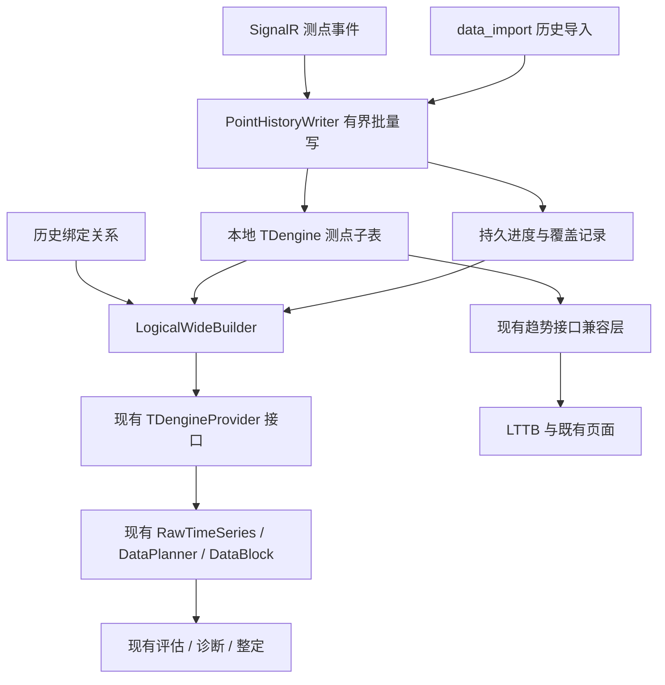

# 测点子表与逻辑宽表重构方案

日期：2026-09-06。状态：用户已确定目标；本文为实施设计，代码和数据库尚未改造。  
独立分支：`codex/tag-timeseries-refactor`；当前基线：`9ee40210e133288830ac8a3ee25103ee6be8bb8d`（含已提交的 WS/token 修复）。  
工作区：`/Users/zhangping/DEV/CLPM-MVP-worktrees/tag-timeseries-refactor`。  
配套：[整改计划](/Users/zhangping/DEV/CLPM-MVP-worktrees/tag-timeseries-refactor/docs/过程文档/2026-09-06-tag-timeseries-refactor-plan.md)、[实施交接](/Users/zhangping/DEV/CLPM-MVP-worktrees/tag-timeseries-refactor/docs/过程文档/2026-09-06-tag-timeseries-refactor-handoff.md)。

## 1. 已定目标与范围

用户已决定：本项目继续保存一份本地 TDengine 历史；每个测点一张子表；提供给算法的仍是回路逻辑宽表。最大程度保持已实现的性能评估、回路诊断、回路整定计算逻辑和取数接口，改造由独立分支实施，主审 Codex 检查后合并。

事实前提：OPC DA 实际时间分辨率 1 秒；AAS 无死区、无压缩，按数值变化保存/发送，并保存各测点质量戳。正常不变化可以按 COV 契约保持；实际断线、丢失、坏质量与无初始值不能因此被填成正常数据。质量变化即使数值未变，也必须被接收和持久化；接口是否完整提供质量事件属于验收项。

本方案变更的是本地物理布局和数据适配，不变更“计算全本地、远端历史只经 data_import 调用”的架构。不引入实时/计算远端自动降级，不迁移数据库产品，不同时换 SignalR 库，不永久双存一套全站秒级宽表。

此前 [整改 S0 契约](/Users/zhangping/DEV/CLPM-MVP-worktrees/tag-timeseries-refactor/docs/过程文档/2026-09-06-data-pipeline-remediation-s0-contract.md) 中“本轮不改 TD DDL”“角色来源信息只在 Redis”“继续按回路合并落库”是旧阶段约束，被本次用户明确的新目标取代；其中已修复的连接池、租约、故障隔离等行为必须保留。旧审查 R01～R21 不是当前未修复清单，执行者须按最新代码核对。

## 2. 基线与改动防线

### 2.1 当前已核对的事实

- [st_loop_data](/Users/zhangping/DEV/CLPM-MVP-worktrees/tag-timeseries-refactor/db/tdengine/01_supertable.sql:30) 为回路宽表，七角色值及单独 PV 质量；缺少其余角色持久质量和独立源时间。
- [订阅写回](/Users/zhangping/DEV/CLPM-MVP-worktrees/tag-timeseries-refactor/backend/app/services/data_source/realtime_subscriber.py:2617) 已把 roleTs/roleQuality 放进 Redis JSON，但 TD 写入仍是九字段行。
- [Provider](/Users/zhangping/DEV/CLPM-MVP-worktrees/tag-timeseries-refactor/backend/app/services/data_source/tdengine_provider.py:142) 主路径查询回路宽表，并查询窗口前的 COV 初值。
- [DataPlanner](/Users/zhangping/DEV/CLPM-MVP-worktrees/tag-timeseries-refactor/backend/app/services/data_planner.py:390) 已合并各指标角色需求，并从 BASE 复用 HF 数据，避免同窗重复查库。
- [core/tdengine.py](/Users/zhangping/DEV/CLPM-MVP-worktrees/tag-timeseries-refactor/backend/app/core/tdengine.py:1) 还有旧 t_*、val、默认 Good 的兼容路径；不能仅改 Provider 后认为所有趋势入口完成。
- 配置中的开发 TDengine 为 3.3.6.0，生产 compose 为 3.3.6.6；这是文件配置值，不代表已探测部署版本。新实现须在这两个目标版本验证，不能依赖最新版文档中的新功能。
- 建分支时 main 存在另一任务的 WS/token 未提交改动，因此先从 736da7da 隔离。收尾核验时这些改动已提交，main 干净；本分支已快进到 9ee40210，完整包含这批修复。后续整合仍由主审核对 main 新提交，不覆盖、重做其他任务成果。

### 2.2 冻结边界

以下“冻结”是本次重构的评审要求，不是阻止用户日后有证据的算法改进：

| 对象 | 本次要求 |
|---|---|
| 性能指标、诊断规则、辨识/整定算法、评分权重、阈值、模型选择及门禁策略 | 数学与业务逻辑零改动；禁止借重构调整结果以使测试通过 |
| HistoryDataProvider / get_provider() | 保留函数名、同步/异步形态、参数默认值、返回类型；工厂恒为本地 TDengineProvider |
| RawTimeSeries / DataBlock / MetricDataBundle | 字段、信号命名、质量键名、形状和空值语义保持；不要求每个消费者认识新表 |
| DataPlanner 查询合并、BASE/HF 复用 | 原样保留；确有必要时只允许小范围缓存版本/适配桥接，不重新设计调度 |
| REST/WS 路由、DTO、前端 API、页面 | 外部契约保持；本重构默认不改前端 |
| 计算函数内直接依赖旧 SQL 的少数调用 | 优先修改其下层兼容函数；无法隔离时只改取数桥接行，逐项列给主审审查，不改算法主体 |

受保护区域至少包括：`backend/app/services/metric_calculator/`、`tuning_identification/`、`tuning_algorithms.py`、`diagnosis_orchestrator.py`、`backend/app/tasks/arma.py`、评估/诊断/整定阈值与评分配置、`frontend/`。任务路径均以本工作区为根。对这些区域出现差异必须逐行解释；“保持接口”不能通过把新查询散落到算法中实现。

## 3. 目标结构



- 原始层按独立测点保存变化及质量，不按回路在写入时合并七角色。
- 逻辑宽表为统一组装结果，可缓存或保留某次计算证据；默认不作为第二份长期全量存储。
- 状态最新值缓存仍服务实时监视；它不能充当原始历史唯一事实源。
- 点级存储独立于回路绑定。一个点被多个回路引用时只保存一份历史；回路改绑不改写点历史。

## 4. 存储、身份与迁移元数据

### 4.1 TDengine 目标 schema

下列 DDL 是拟实施契约，未执行。实际库名从 TDENGINE_DB 注入；示例用 clpm_ts。P1 在目标版本验证 SQL、类型、空值与同 ts 更新行为后，将其纳入版本化迁移脚本。

```sql
CREATE STABLE IF NOT EXISTS clpm_ts.st_point_data_v1 (
    ts              TIMESTAMP,
    value           DOUBLE,
    quality_raw     INT,
    quality_class   TINYINT,
    quality_schema  TINYINT,
    received_at     TIMESTAMP,
    source_kind     TINYINT,
    payload_hash    BINARY(64)
) TAGS (
    point_id        BINARY(36),
    source_id       BINARY(64)
);
```

- 子表命名固定为 `p_<tag_registry.id 去连字符的小写 UUID>`，只接受验证后的 UUID；不从用户可编辑位号拼接表名。点身份不能因为回路改绑/改名变化。
- `ts` 为该条来源记录的时间，不是 flush 时间。保留毫秒精度，不先截成秒，也不人为加毫秒解决冲突。
- `value` 仅存当前七类数值角色的有限数或 NULL；MODE/PID 与 PV/OP/SP 共用稳定结构，进入算法时保持原有类型语义。扩展任意文本 OPC 点不在本次范围。
- `quality_raw` 保留收到的原码；`quality_schema` 标明 AAS 枚举或 OPC DA 位编码，不能把不同体系的 2/3 混用。未知原码可为 NULL，禁止自动 Good。
- `quality_class` 使用本层固定三态：1=GOOD，0=BAD，-1=UNKNOWN/UNCERTAIN；区分细节仍在原码。该三态专供兼容现有预处理，不能改其全局映射函数。
- `source_kind` 固定：1=实时变化；2=首次/恢复快照；3=确认的原始历史事件；4=远端接口已重建的规则样本。未知语义导入不得冒充 3。
- `received_at` 保留接收时间用于审计，绝不作为原始历史 ts 的兜底。
- `payload_hash` 覆盖归一化点 ID、ts、值、质量及来源类别，用于完整载荷对账；语义去重单独比较点 ID、ts、值和质量，同一事实经实时与历史重放不因来源类别不同被判冲突。不把 hash 当成存储恢复副本。
- `source_id` 是源身份，不是局域网/公网网络模式。不要把当前 loop_id、role、unit_id 作为历史归属写进子表静态 TAGS。
- 首次实施保持现有数据库保留期与时区精度，不同时调持久化、保留年限和 vgroup 数；容量问题通过验收量化。

### 4.2 PostgreSQL 元数据（新增迁移，复用既有配置/任务模型）

精确 ORM/DDL 在 P1 落地并由主审检查；以下字段/约束必须实现，不得以进程内字典替代：

| 实体 | 最小信息和约束 |
|---|---|
| loop_tag_binding_history | loop_id、role、tag_id、valid_from、valid_to、mapping_version、basis；同回路角色生效区间不得重叠。现有 loop_tag_mapping 保持当前视图和 API，不删除；当前绑定变化与历史记录同一 PG 事务 |
| history_coverage_segment | source/session 或 point 作用域、起止时间、绑定/订阅集合版本、状态、持久批次边界、来源任务；支持相交、合并、缺口及恢复。按连接会话/分块登记并合并，禁止每测点每秒写 PG |
| history_layout_manifest | 回路/来源适用范围、生效边界、legacy/point/shadow 模式、数据版本；精确决定某窗口使用哪种本地布局 |
| history_write_batch | batch_id、输入摘要、目标表/时间段、状态、分块结果、失败原因、恢复信息；复用现有任务状态时也必须表达部分成功及未确认 |
| history_point_conflict | 点 ID、源 ts、已存/新 payload、来源任务、处理状态；同 ts 不同值/质量不得悄悄用到达顺序覆盖 |
| point_state_anchor | 点 ID、原 sourceTime、值、质量、确认时间、覆盖依据、数据版本；用于初始/恢复与保留期边界，不能伪造新的变化事件 |

可以在实现中合并职责相同的实体或复用已有表，但须保留以上信息、约束、崩溃恢复能力和逐项映射，不为形式机械增加六张新表。

元数据也须有生命周期：已确认批次可合并归档，覆盖区间按相同语义合并，保留期边界锚点低频维护；不得形成每测点每秒写 PG 或永久增长的任务账本。清理前须证明不影响重试、冲突审计、有效历史读取和回退。

初次建立绑定历史时，只从可信基线时刻建立当前绑定，不把未知过去追溯成当前绑定；此前历史继续 legacy 读取。测点删除/重建须保留历史身份与别名依据，不能因为同名就拼接不同点历史。

初期采集范围沿用当前已配置订阅点集合，不借重构扩大 AAS 订阅量；未绑定/已解绑点的既有历史按保留策略保存，不能随内存缓存清理而删除。新绑定点能否覆盖历史窗口由其实际点历史和绑定依据决定。

### 4.3 重复、迟到与写入确认

- 同一点同 ts、值/质量相同为幂等重放；初始快照、恢复快照不重复计为变化。
- 迟到事件可以补入其真实历史时刻；“不能回退最新值”只约束当前状态缓存，不能再用 latest-value 的拒绝规则丢掉合法迟到历史。
- 同点同 ts 不同 payload 先保留既有事实并登记冲突；该冲突对读取的影响要明确，默认将对应不确定时段标未知。获授权的 overwrite 才能执行带备份/恢复记录的更正；skip 不修改已存在冲突点。
- 同点写入与导入协调串行/租约所有权；不能假设 TD 跨表 INSERT 或 PG+TD 是一个事务。
- 原始事件缓冲禁止按 `loop→role` 覆盖同一 tick 多次更新；显示缓存仍可只保留最新值。
- 元数据覆盖/批次成功在 TD 写入确认后推进。TD 成功而元数据失败可幂等重试；响应丢失不能既丢重试数据又写成功水位。
- 进程崩溃前尚未持久接纳的数据不承诺无损；恢复从最后持久边界登记未知窗口。队列满、租约丢失、取消均记缺口，禁止默默补成正常 COV。
- snapshot 只证明恢复时取得的状态，不能凭它填平断线期间；来源时间很旧的常值可以在恢复后重新作为已知状态，但不倒推恢复前的整个窗口。

## 5. 逻辑宽表构建：唯一实现

建议新建内部模块 `point_history_repository.py`、`logical_wide_builder.py`、`history_layout_router.py`；命名可小幅调整，但职责与依赖方向固定。算法和 endpoints 不直接访问测点子表。

### 5.1 输入输出契约保持

保留 [现有签名](/Users/zhangping/DEV/CLPM-MVP-worktrees/tag-timeseries-refactor/backend/app/services/data_source/base.py)：

```python
get_provider() -> HistoryDataProvider
provider.make_query_fn(db) -> QueryFn
await query_fn(loop_id, tag_roles, start, end, interval_s) -> RawTimeSeries
await provider.query_trend_data(tag_name, start_time, end_time, sample_interval=1)
    # 仍返回 list[dict]，保留 ts/value/quality 等既有约定
await provider.close()
```

`RawTimeSeries` 不新增必填字段，所有 signals 和 quality_codes 数组与 timestamps 等长。role 名仍为 `pv/sp/op/mode/pid_p/pid_i/pid_d`，质量键仍为 `{role}_quality`。原始元数据存内部 DatasetMeta/覆盖记录，不能要求指标逐个处理新表/新来源类型。

### 5.2 构建步骤

1. 解析并验证查询窗口、角色集合、UTC 时刻；解析历史绑定，将跨改绑窗口分段。
2. 布局路由器按 manifest 选择 legacy 或 point，不能查询异常时自动换源。
3. 对所需测点批量读窗口内事件，以及窗口前最后一个**状态事件**和适用 anchor。不能仅查最后一个非 NULL/Good 值，以免跳过 BAD/NULL 状态。
4. 合并 source/session 覆盖与点级缺口；确认可以保持的时段。正常 COV 无变化不按“超过 N 秒没事件”判缺失；传输有 Pong 不等于采集覆盖完整。
5. point 路径 v1 返回 **统一 1 秒逻辑网格**，与当前本地查询实际保留 1s/HF 的兼容行为一致。保留 interval_s 参数，不把 BASE 的 5s/10s 名义值直接用于降采样，导致复用它的 PVOP_HF 丢分辨率。以后支持多档网格须另立变更。
6. 网格固定在 UTC 整秒；对每个 t 取不晚于 t 的最近角色状态，不看未来。跨绑定使用新点，新点无 anchor 时为未知；禁止沿用旧绑定值。事件的毫秒时间保留，t 之前发生的变化才能生效。
7. 输出完整网格；已知有效保持保留原值，BAD 质量随状态保持，未知区间值为 None/NaN 且质量 -1，不能删除未知行压缩时间轴。
8. 返回 RawTimeSeries 给现有预处理，保留归一化、异常识别、Metric Mask、可信度、模型准入和结果构造。SP/MODE/PID 的保持在此完成；现有整定 SP 对齐函数收到相同网格时应是恒等操作，不需重写。
9. 同一回路/窗口/角色并集只构建一次，继续让 DataPlanner 派生各 tagGroup；内部扫描按表/时间/字节分块，不允许每点或每秒一次 SQL。

若只有一个网格点，现有 Pipeline 可能按 nominal label 兜底；以其既有短窗/数据不足规则处理，不为了这一重构改变算法最低点数。实际空窗口、API 非整秒边界都要锁定契约样例，禁止偷偷取整扩大数据窗口。

### 5.3 时间边界与区间

- [TimeWindow](/Users/zhangping/DEV/CLPM-MVP-worktrees/tag-timeseries-refactor/backend/app/contracts/data_types.py:102) 当前定义起止均含；Provider 维持该外部契约。point 网格为所有满足 start≤t≤end 的 UTC 整秒时刻。
- 内部批次/覆盖记录使用半开区间 [a,b)，拼接时去重；布局切换点 T 归 point，legacy 仅承担 t<T。外部闭区间与内部半开转换集中到一个 helper。
- 所有 naive 入口先按已有已验证接口口径归一，不能在不同入口分别猜 UTC/+8；内部统一 aware UTC。输出 RawTimeSeries 保持下游既有 datetime 表达，并用跨时区契约测试固定。
- 源分辨率 1 秒不授权丢掉已有毫秒时间。秒内多变化在原始层保留；逻辑网格为既定采样视图，不宣称表达全部亚秒动态。

### 5.4 质量兼容

既有 [quality_code.py](/Users/zhangping/DEV/CLPM-MVP-worktrees/tag-timeseries-refactor/backend/app/services/preprocessing/quality_code.py:34) 将 1/2/3/192 视为 Good，None 也视为 Good。不能直接把 AAS 的 Bad=2/离线=3 或缺失原码透传给它。

在新适配层依据 quality_schema 解码，输出给旧层：Good=1，Bad=0，未知/Uncertain=-1；所有请求角色都显式输出质量数组，不使用省略键或 None 来表达缺失。OPC DA 按原始位语义解码，AAS 按确认的枚举解码；无法识别的体系不得猜测。

未知覆盖区间强制值无效，保证旧 validity 机制能够识别缺口。Uncertain 和真实 BAD 按现有算法准入处理，不改全球质量阈值。原始质量和导致未知的原因保留在内部元数据中用于验收和解释。

正常保持只能解决时间覆盖，不增加动态激励；既有冻结检测、模型最少数据量等门禁不因“网格填满”被取消。测试不能要求每个常值 PV 都获得 A 或可整定结果。

### 5.5 性能与查询预算

- 热计算仍以单回路小时窗口复用；元数据批量预载，避免每个角色独立访问共享 AsyncSession。
- 单点趋势走点历史；先在完整事件/状态语义下构建显示数据，再做 LTTB。LTTB 只服务显示，不能进入模型输入。
- 30 天合法趋势可在内部流式扫描/降采样，但现有 RawTimeSeries 是完整列表：仅把 SQL 分块不能保证大计算窗内存有界。必须测真实最大计算窗口；不足时登记容量阻塞，不能截短数据或擅自改变算法窗口。
- 缓存键至少含 storage_layout_version、窗口、角色集合、绑定版本、数据/覆盖 revision、重建策略版本。旧 Redis history 行/L1/L2/L3 不能直接命中新布局。
- 导入、更正、补数、冲突解决、改绑和覆盖变更触发相关版本失效；在途旧查询不能把旧数据重新填回当前版本。
- 一次构建固定绑定/布局/数据/覆盖版本；读取期间版本变化时有界重试或返回未确定状态，不混用两个已发布版本。历史替换前先登记 pending 并使受影响覆盖失效，替换确认后才发布新版本；不能依赖 PG+TD 的跨库原子性。
- 原始事件保留期外的常值需要锚点。定期锚点必须携带原 sourceTime 和覆盖依据，不新增伪变化，不越过已知 gap。

## 6. 导入、监控与旧入口兼容

### 6.1 历史导入

外部导入 API、参数、任务状态字段、skip/overwrite 选项保持。data_import 是远端历史唯一调用方；不能将原始补齐能力散落到 Provider。

原始 AAS 事件可按测点入库。若 HistoryData/Get 实际返回的是 sampleInterval 重建数组，按 HISTORY_GRID 保存，不宣称原始事件。复核每角色质量及窗口前状态；全空响应只有在来源合同能证明该窗口无变更且有起始状态/覆盖时才可判定完整，否则不推进完成覆盖。

任务计数保持既有对外语义：实现前用样例锁定“点数”当前究竟指行/时间槽还是标量，不能换成七倍物理记录数而继续沿用同一字段。内部另计物理事件数、去重数、冲突数和有效逻辑槽数。

共享测点的 skip/overwrite 需点级协调；overwrite 对指定回路的点历史更正可能影响引用该点的其他回路，影响集合必须可审计并使相关缓存失效。保留 now−5min 限制；gap 必须 skip。先暂存/验证，具备原数据备份与中断恢复后才替换；替换期间相关读取不能把部分新旧数据判为完整，取消/部分写不谎报成功。

### 6.2 绕过 Provider 的路径

P0 生成活跃调用清单并区分已注册/死代码；默认在现有底层函数内部适配。至少核对：

- core/tdengine.py、core/tdengine_native.py 的单点趋势、宽表查询和窗口前状态；
- data_integrity、data_link_monitor、data_import 的旧 st_loop_data/COUNT(*)；
- monitor、tag、performance、report_stats、handling_stats、tuning 和 kpi_calc 的取数调用；
- 旧 t_*、val、无质量默认 Good 的路径，不能把它直接当作新测点 schema。

已退役诊断代码只登记，不删除、不重新注册。路径中出现“loop”不等于依赖 TD 宽表，禁止按 rg 字面命中机械修改业务聚合 SQL。

### 6.3 完整性

保留完整性接口响应结构和“数据源不可用”标志；内部改为逻辑时间覆盖，而非按测点事件行数÷3600。正常 COV 的无变化时段可以完整；真实未知时段不能因填网格变完整。缺失与 BAD 质量仍按现行产品定义分别统计。

数据链路状态同时提供内部物理写入量与逻辑覆盖依据，不能把物理事件数减少误报成停止采集，也不能把只收 Pong 当成采集正常。

## 7. 迁移、灰度与回退

配置只选择本地布局，建议内部开关 `history_storage_mode=legacy|shadow|point`；默认 legacy。source factory 和网络模式保持原状。配置真相源遵守 sys_config，启动设置仅兜底；写入开关和读取 manifest 独立，避免切读触发未经准备的空库。

1. 建新 schema/元数据并记录迁移版本，旧表与旧读保持。
2. 在有界测试回路集合开启 shadow 写，旧与新使用同一接收事实/重放数据；新写失败不能错误确认成功，也不能影响现行读。双写只为迁移验证，设置结束条件。
3. point reader 在后台影子读取，不影响用户返回；与可信密集基准、legacy 结果分别比较。旧结果已知错误不能作为新实现必须复制的真值。
4. 验证后的回路/时间窗写入 manifest；跨窗口分段路由；新布局异常不静默 fallback 为 legacy 的旧值或默认 Good。
5. 全部活跃消费者验收后扩大 point 范围；停止旧实时宽表写入须先明确回退可覆盖的时间段。
6. 首轮合并保留 legacy reader、旧表和 manifest，禁止清库/删表。用户后续单独确定数据保留、补齐、旧表退役。

旧宽表缺失各角色源时间/质量，不能逆推还原为真原始事件。默认继续以 legacy_snapshot 路径读取，不自动“转换”并提高可信度。若通过 AAS 导入补齐某段，则完成 point 质量、覆盖与该时段角色绑定依据核验后显式更新 manifest；仅导入点值不证明当时属于哪个回路角色。

回退优先恢复同一新 schema 的前一个稳定兼容版本；影子双写期间可回 legacy 读取。旧写已停止后，legacy 不包含新时间段，不能宣称一键切回全部恢复；必须保留 point reader 或从点历史受控重建兼容数据。代码回退不删除点事实、覆盖记录和历史绑定。

## 8. 验收原则

- 同一份可信 1 秒密集数据，一路直接生成参考 RawTimeSeries，一路编码成 COV→写点表→重建；时间轴、值、质量、类型、掩码一致。
- 使用完全相同的现有 Pipeline 和算法，比对 DataBlock、指标状态/原因码、评分、诊断与模型/整定结果；固定随机种子、版本和输入。不能通过改阈值、放宽断言或替换算法取得一致。
- 对原实现已知错误输入单列纠偏用例；良性等价用例应相等，未知/质量冲突用例应符合明确的新适配契约。
- 真实 Redis/TD/PG 验收与 fake 单测分开；迁移、部分写、崩溃、同 ts 冲突、边界 anchor、跨改绑、保留期与缓存竞争为必测项。
- 本设计不宣称当前性能或迁移已通过；逐项门槛见配套计划。

## 9. 参考与决策记录

- 现行纪律：[AGENTS.md](/Users/zhangping/DEV/CLPM-MVP-worktrees/tag-timeseries-refactor/AGENTS.md)；历史文档先对照 [stale-docs](/Users/zhangping/DEV/CLPM-MVP-worktrees/tag-timeseries-refactor/docs/过程文档/stale-docs.md)。
- 旧问题证据：[2026-09-06 审查报告](/Users/zhangping/DEV/CLPM-MVP-worktrees/tag-timeseries-refactor/docs/过程文档/2026-09-06-data-pipeline-code-review.md)，整改后状态以当前代码为准。
- [TDengine 数据模型](https://docs.tdengine.com/cloud/programming/model/) 支持多列/单序列模型；本设计不把任意“每回路宽表”当成同时采样。
- [TDengine 查询能力](https://docs.tdengine.com/tdengine-sql/data-query/query/) 随版本变化；v1 选择应用层有序保持/组装，不把 ASOF/虚拟表作为上线前置。
- 2026-09-06：用户确认本地测点子表＋算法逻辑宽表，最大程度冻结计算与取数接口；新分支准备完成。未执行新 DDL、业务改造、生产动作或合回 main。
