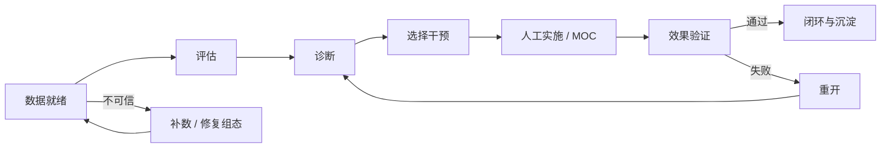
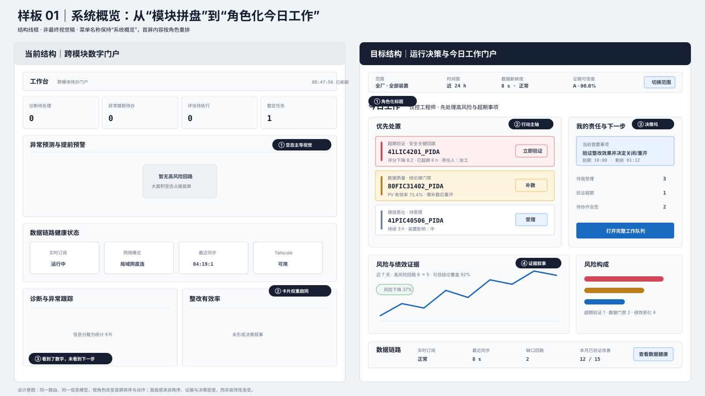
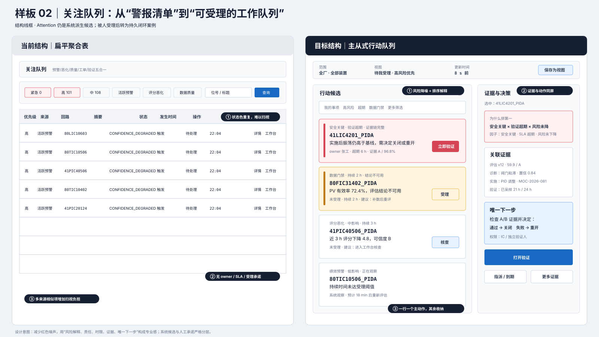
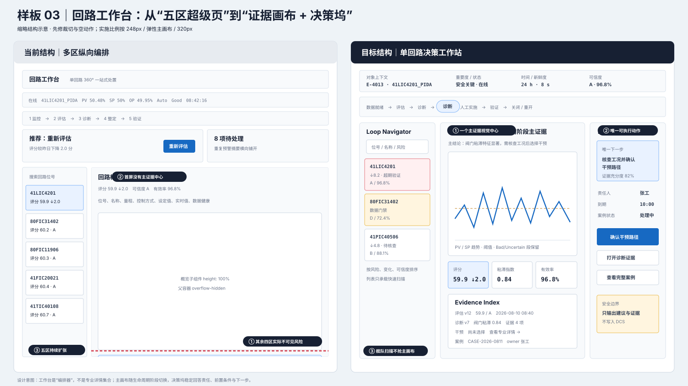
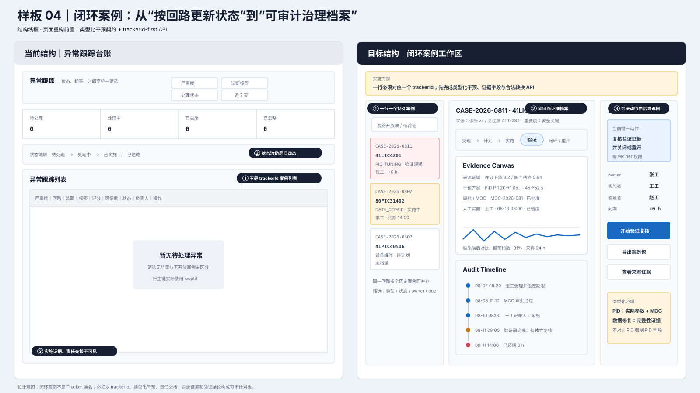
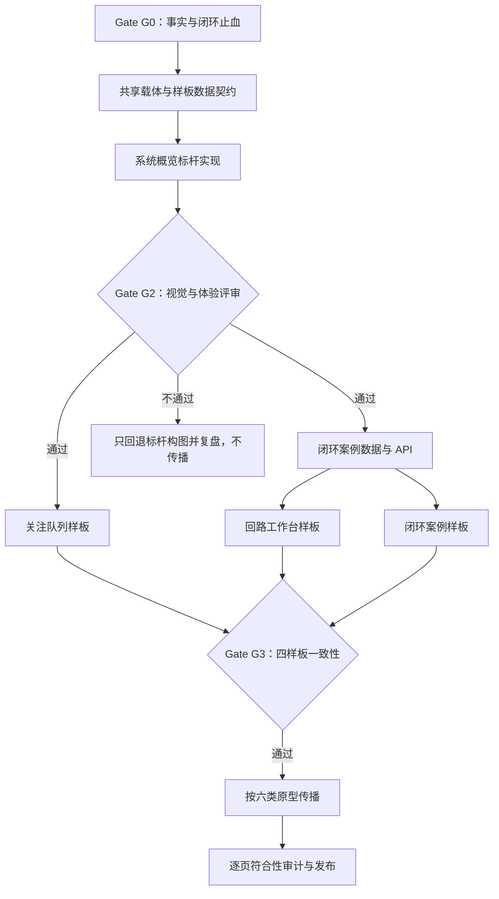

# CLPM IA 驱动的 UI/UX 重构与页面品质提升方案

| 项目 | 内容 |
|---|---|
| 文档版本 | v1.1 |
| 文档日期 | 2026-08-11 |
| 文档状态 | 可实施方案；系统概览样板通过 Gate G2 前，不授权全站传播 |
| 事实基线 | 当前代码 `f42642bb`、实现契约 v2.11、PRD v6.2、UI/UX v6.3 |
| 上游决策 | [IA v2.11 第一性原理复盘与优化建议](./10-IA-v2.11第一性原理复盘与优化建议-2026-08-11.md) |
| 实施对象 | 前端 Vue 3 + Ant Design Vue、必要的 BFF/API/Schema、E2E 与视觉验收 |
| 第一标杆页 | `/dashboard/workbench` 系统概览 |
| 后续样板页 | `/monitor/attention`、`/monitor/loop-workbench`、`/diagnosis/tracker` |
| 安全边界 | 只输出建议、证据、风险、回退与人工实施留痕；不写入 DCS |
| v1.1 增补 | 装置绩效双镜头、Attention 大规模加载、工作台完整闭环与筛选、页面名称—功能准入、线框按需规则 |

> 本方案不是一轮“换颜色、加阴影、换卡片”的视觉装修。它把已经明确的 IA 坐标——对象与范围、决策生命周期、工作状态、角色责任——变成用户在页面上看得见、用得上、可验收的界面结构。

---

## 0. 执行结论

### 0.1 决策

1. **IA 重构必须同步带动页面 UI 与 UX 重构。** 如果 IA 只停留在菜单、路由和文档，用户仍会面对同权卡片、信息重复、主动作失焦和跨页上下文丢失，新的架构不会转化为新的使用体验。
2. **先做一个标杆，再决定传播尺度。** 第一阶段只把系统概览做成“精密工业工程工作站”的视觉与体验标杆；通过业务、角色、视觉、性能和用户判断五类门禁后，才复制到另外三个样板页。
3. **需要全站逐页检查，但不应先逐页各自重设计。** 正确顺序是“六类页面原型 → 四个样板验证 → 按原型传播 → 逐页符合性审计”。这样既能保证一致性，也避免 40 多个页面形成 40 套局部设计。
4. **高级感的来源是秩序与可信度，不是装饰。** CLPM 的目标气质定义为 **Precision Industrial Workbench（精密工业工程工作站）**：冷静、精确、证据优先、动作克制、责任清楚、异常醒目但不满屏告警色。
5. **四个样板不是纯前端任务。** 系统概览需要统一快照/partial 语义；闭环案例需要 `trackerId-first` API 与类型化干预契约；回路工作台必须先修内容裁切和空动作；这些前置条件未完成时不得用假数据做“高保真完成态”。
6. **线框不是每个页面的强制交付物。** 默认用 Page Contract、结构表、动作矩阵和 Given/When/Then 验收表达需求；只有 §5.5 的触发条件成立时才补一张低保真线框。

### 0.2 本次交付物

| 交付物 | 用途 |
|---|---|
| 本实施方案 | 目标、方法、设计规则、依赖、验收、行动计划与智能体任务清单 |
| [系统概览改造前后线框](./assets/ia-uiux-2026-08-11/01-系统概览-改造前后.svg) | 第一视觉与体验标杆 |
| [关注队列改造前后线框](./assets/ia-uiux-2026-08-11/02-关注队列-改造前后.svg) | 例外驱动的行动队列样板 |
| [回路工作台改造前后线框](./assets/ia-uiux-2026-08-11/03-回路工作台-改造前后.svg) | 单对象证据工作站样板 |
| [闭环案例改造前后线框](./assets/ia-uiux-2026-08-11/04-闭环案例-改造前后.svg) | 持久治理案例样板 |

四张既有线框只用于解释结构语法，不是功能清单、数据量上限或逐像素实施稿；v1.1 不新增图片。实施智能体必须以本方案的 Page Contract、数据/动作/状态契约和验收条目为准。

### 0.3 第一阶段成功长什么样

系统概览标杆上线到评审环境后，用户在 3 秒内应能回答：

1. 当前看的范围和数据时间是什么；
2. 今天最重要的三件事是什么；
3. 为什么它们排在前面；
4. 我负责什么、什么时候到期；
5. 下一步应执行哪个动作。

若首屏仍主要由等权 KPI、通用白卡、大片空态或基础设施状态占据，即使配色更精致，也不视为本阶段成功。

### 0.4 目标—方法—动作—验收总表

| 目标 | 方法 | 首要动作 | 验收 |
|---|---|---|---|
| IA 在页面上可感知 | 四条 IA 坐标映射为 Context/Lifecycle/State/Decision | 先修上下文、状态、动作事实 | 用户能回答对象、阶段、责任、下一步 |
| 建立专业工业品质 | Precision Industrial Workbench + 一页一主画布 | 系统概览先做标杆 | 18 项 UI/UX + 4 项语义门禁，品质评分 ≥90 |
| 缩短任务闭环 | 例外驱动、证据与动作同屏、持久案例 | Attention→Case、Workbench→Evidence/Decision | 关键入口 ≤1 点击，无 no-op/403 |
| 控制全站重构风险 | 六类原型、四样板、分阶段 Gate | Gate G2 决定 S0~S3 传播等级 | 未通过不传播；通过后每页 ≥85 |
| 可交给智能体执行 | 带唯一 ID 的原子任务、显式依赖、DoD 与证据回填 | 一次领取一个任务 ID | 作者/验收分离，测试/截图/性能/文档齐全 |

---

## 1. 范围、非目标与事实优先级

### 1.1 本方案负责

- 将 IA 的对象、时间、阶段、工作状态、角色责任映射为稳定的页面区域；
- 定义共享的构图语言、信息密度、动作层级和证据表达；
- 设计四个样板页的目标结构、数据契约、状态与验收；
- 建立页面名称、用户任务、内容、动作与持久结果的一致性准入门；
- 建立从系统概览标杆到全站传播的决策门；
- 把工作拆成可由其他智能体独立领取、验证、回填证据的原子任务。

### 1.2 本方案不负责

- 不重排六个一级模块，不恢复独立“回路”模块；
- 不建设“驾驶舱 / 工作站”两套并行 IA；
- 不复制 DCS/SIS HMI，不把 CLPM 做成过程控制画面；
- 不重新发明已经完成的色彩 token、空态、列设置、密度切换、暗色基础校准、单回路配置四步向导；
- 不先建独立 `governance_case` 大模型；优先演进 ActionTracker，只有关系复杂度被证据证明不足时再评估新表；
- 不允许任何“下发参数”“自动写入 DCS”“审批后自动实施”入口。
- 不要求每个新页面重画线框，也不把图片当作功能规格或规模契约。

### 1.3 事实优先级

实施智能体遇到冲突时，按以下顺序判断：

1. 当前运行代码、数据库迁移、后端权限与实际 API；
2. 实现契约 v2.11；
3. PRD v6.2 的产品范围与安全边界；
4. UI/UX v6.3、色彩约定、文案词表；
5. 本方案的目标设计；
6. 归档文档与历史截图。

若 1~4 存在冲突，不得自行选择“看起来更合理”的一份实现；应先完成 `TRUTH-*` 任务并把决策回填到事实源。

---

## 2. 为什么 IA 与 UI/UX 必须一起改

### 2.1 第一性原理

CLPM 的价值终点不是“算出一个分数”，而是“经过验证的回路改善”。界面必须支持完整链路：



现有功能已经覆盖大部分节点，但视觉结构仍主要按“模块有什么”平铺，未持续回答“当前阶段是什么、证据是否可信、谁负责、下一步是什么”。这正是 IA 需要通过 UI 落地的部分。

### 2.2 当前“看起来平淡”的真实原因

现有页面已经完成 token、对比度、空态和部分工业组件治理；问题不再主要是颜色不够高级，而是：

- **构图权重趋同**：多个白色区域尺寸和视觉重量相近，没有一个明确主画布；
- **数字多、决策少**：KPI 回答“多少”，却不回答“哪几件、为什么、谁处理”；
- **数据快照不同步**：一个页面由多个接口与组件各自刷新，看起来统一，事实时间不统一；
- **风险色重复**：优先级、来源、状态同时用红/橙，真正紧急事项反而不突出；
- **空态体量过大**：正常无风险时呈现为“页面没做完”，而不是冷静、稳定；
- **动作散落**：多个 CTA 同权，或最重要的 CTA 无反馈；
- **领域对象不稳**：Tracker 仍按 `loopId` 操作最新开放记录，页面无法成为真实案例档案。

### 2.3 现有验收为什么还不够

现行 UI/UX §14 的 18 项强制检查仍必须保留，但它主要保证“正确、可用、合规”：无空点击、权限正确、状态与颜色正确、可信度不伪造、危险操作受控、响应式和可访问合格。

当前视觉走查主要证明页面能渲染、对比度合格；现有角色冒烟主要证明可进入且无 403。它们没有验证：

- 首屏是否有唯一视觉锚点；
- 用户是否能在 3 秒内识别最高优先事项；
- 证据、解释和动作是否同屏；
- 角色是否看到不同的任务排序；
- 深链与主动作是否真正完成闭环；
- 页面是否具有稳定、克制、专业的工业软件构图。

因此本方案在既有 18 项上新增“页面语义门禁 + 页面品质门禁”，而不是替换已有规范。

---

## 3. 目标体验与视觉命题

### 3.1 体验命题

> **在可信上下文中，让正确角色以最少跳转完成下一个正确决定。**

每个核心页面都应形成一条稳定阅读路径：

```text
对象与范围 → 当前状态 → 关键证据 → 风险解释 → 责任与时限 → 唯一下一步
```

### 3.2 视觉命题：Precision Industrial Workbench

| 维度 | 目标感受 | 页面表达 |
|---|---|---|
| 冷静权威 | 正常态安静，异常态局部醒目 | 90% 中性色；高饱和色只标记真正异常和主动作 |
| 精密可信 | 数字、时间、版本和来源可核查 | 等宽数字、明确单位、快照时间、可信度和数据新鲜度 |
| 工程秩序 | 页面像工作站，不像营销大屏 | 边框与网格优先，少阴影、无装饰渐变、区域职责稳定 |
| 决策导向 | 一眼知道先做什么 | 一个视觉中心、一个 primary CTA、动作禁用给理由 |
| 安全克制 | 不夸大预测，不暗示自动实施 | 使用“绩效趋势风险提示”；实施与验证明确人工边界 |
| 可审计 | 人、时间、证据、状态可追溯 | owner/due、MOC、实施者、验证者、timeline、版本引用 |

### 3.3 高级感的六个可执行准则

1. **一页一个视觉中心**：主画布占据最大有效面积，其他区解释或支持它。
2. **一屏一个主动作**：同一时刻最多一个高强调 CTA；次动作不超过两个，其余进入“更多”。
3. **数字必须有语境**：关键数值至少配基线、阈值、变化、可信度中的适用项。
4. **状态色只表达状态**：类别使用中性标签；正常、零值和无数据不用成功绿或危险红。
5. **空态服从任务**：正常无风险用紧凑稳定态；筛选无结果、无权限、接口失败、数据不可信分别表达。
6. **白空间用于分层，不用于占位**：任何无业务理由的空白区域不得超过可见内容区 30%。

### 3.4 明确禁止

- 紫色/蓝色营销渐变、霓虹描边、玻璃拟态和满屏阴影；
- 把正常状态做成大面积绿色“成功庆典”；
- 为了“高级”降低信息密度、放大卡片和图标；
- 用环形图、仪表盘或 3D 图替代可比较的趋势、条形或表格；
- 在一个页面放多张同权大图；
- 让前端根据角色字符串自行猜测可执行动作；
- 用假 owner、假 SLA、假趋势填满目标稿。

---

## 4. IA 到界面结构的映射

### 4.1 四条坐标与界面载体

| IA 坐标 | 用户问题 | 稳定载体 | 最低内容 |
|---|---|---|---|
| 对象与范围 | 我在看哪座厂、哪个装置、哪个回路？ | `ClpmOperationalContextBar` | scope、object、timeWindow、requestedAsOf/dataAsOf |
| 决策生命周期 | 这件事走到哪一步，为什么停在这里？ | `ClpmLifecycleRail` | 当前阶段、完成时间、阻塞原因、证据状态 |
| 工作状态 | 谁已受理、何时到期、是否超期？ | Queue / Case State + `ClpmResponsibilityBlock` | owner、due、SLA、case status |
| 角色责任 | 我能做什么、下一步是什么？ | `ClpmDecisionDock` | primaryAction、enabled、disabledReason、requirements |

### 4.2 证据画布

`ClpmEvidenceCanvas` 不是一个任意 slot 的大白盒，而是一个有类型的页面构图模式：

- 标题必须是一个决策问题或结论，而不是泛化的“数据分析”；
- 主图只呈现当前阶段最重要的证据；
- 同屏展示数据范围、基线/阈值、可信度和更新时间；
- 其他评估、诊断、整定、实施、验证结果进入 Evidence Index，以摘要和深链呈现；
- loading、partial、stale、INCONCLUSIVE、empty、error 都是正式状态。

### 4.3 上下文信封

跨模块跳转至少保留以下字段；实现可通过 URL + store 组合，但不得只拼 `loopId`：

```ts
interface OperationalContext {
  plantNodeId?: string;
  unitId?: string;
  loopId?: string;
  timeWindow?: string;
  requestedAsOf?: string;
  dataAsOf?: string;
  attentionId?: string;
  eventId?: string;
  taskId?: string;
  trackerId?: string;
  returnTo?: string;
}
```

任何目标页无法消费的字段应显式记录为契约缺口，不得静默丢弃。

---

## 5. 页面原型族：先定模式，再逐页检查

全站页面归入六类原型。后续“逐页 UI/UX 检查”检查的是页面是否正确套用原型和领域变体，而不是每页重新发明构图。

| 原型 | 核心问题 | 标准结构 | 首批样板 |
|---|---|---|---|
| P1 角色首页 / 总览 | 今天最重要的事是什么？ | Context → Priority Spine → Evidence → Decision | 系统概览 |
| P2 行动队列 / 列表 | 哪些事项应先受理？ | Filter/View → Queue → Evidence Drawer/Dock | 关注队列 |
| P3 单对象工作站 | 当前回路下一步怎么判断？ | Navigator → Context/Lifecycle → Evidence → Decision | 回路工作台 |
| P4 分析 / 详情 | 结论由哪些证据支持？ | Object Header → Main Evidence → Evidence Index | 诊断详情、回路性能、整定详情 |
| P5 工程配置 | 如何安全完成低频高风险组态？ | Readiness → Step/Dependency → Form/Table → Impact Confirm | 链路、Tag、回路、规则配置 |
| P6 治理 / 审计 | 谁在何时改变了什么？ | Scope → Dense Ledger → Diff/Timeline → Export | 闭环案例、审计日志、权限矩阵 |

### 5.1 是否需要全站逐页检查

需要，但按三轮执行：

1. **原型审查**：六类各选 1~2 页，确认信息层级与组件契约；
2. **传播审查**：按原型把共享结构传播到核心页面；
3. **逐页符合性审计**：检查所有 canonical route 的状态、权限、密度、动作和响应式，旧兼容页只验证跳转。

这比一开始逐页“美化”更快，也能保证全站不会出现新的视觉碎片。

### 5.2 页面名称即功能承诺

后续所有新建或重构页面必须满足以下闭环，页面名称不是装饰文案：

```text
页面名称 → 用户任务 → 核心内容 → 唯一主动作 → 可持久验证结果
```

任一环缺失，不得使用“工作台、队列、中心、管理、配置、分析、诊断、报表、知识库”等具有明确能力承诺的名称。“中心”只用于聚合多个对象类型或覆盖完整生命周期的能力，不能作为普通列表的修饰词。

| 名称/类型 | 最低内容与功能承诺 | 主动作与持久结果 | 禁止情形 |
|---|---|---|---|
| 概览 | 范围、关键指标、风险/趋势、更新时间、异常摘要 | 筛选并携带上下文下钻 | 只有导航卡；无范围/时间仍称实时概览 |
| 监控 | 当前状态、变化、异常、数据新鲜度、失联/过期 | 确认、定位或转工作项 | 只有历史图；不区分当前与历史 |
| 工作台 | 单一对象/案例的完整上下文、证据、阶段和可执行动作 | 有写 capability 的角色推进阶段并落库/审计；只读角色安全下钻 | 只有指标卡和跳转；核心任务需跨多页拼接 |
| 处置队列 | owner、优先级、期限/SLA、状态、来源和筛选 | 领取、指派、升级、关闭或转案例 | 只有无责任、可消失的派生结果 |
| 运行任务中心 | 异步计算输入、进度、日志、重试、输出和终态 | 取消、重试、查看产物 | 与人工待办混称“任务” |
| 列表/详情 | 查找/比较/选择；稳定 ID、状态、证据、关联和时间线 | 定位对象或执行上下文动作 | 详情重复列表字段；刷新/返回丢上下文 |
| 管理 | 新增、编辑、停启用、生命周期、批量能力和审计中的主要能力 | 产生版本化、可追溯变更 | 纯只读表格却称管理 |
| 配置/工程组态 | 校验、依赖、影响、测试、版本、审计和必要回退 | 测试并保存明确生效版本 | 只展示当前值；无生效范围和回退 |
| 分析 | 明确对象/问题/时间窗、数据源、方法、口径和可信度 | 运行、比较、保存可复现产物 | 普通图表集合，无模型/口径/置信度 |
| 诊断 | 原因假设、证据链、反证、置信度和建议动作 | 接受、驳回、升级或转案例 | 只有 AI 文案或确定性结论 |
| 统计 | 可交互聚合、切片、对比、下钻和透明口径 | 保存视图或定位差异 | 固定截图或几张数字卡称统计中心 |
| 报表 | 周期、范围、生成时间、来源、口径版本和发布产物 | 生成、发布、导出版本 | 把实时仪表板或当前页导出称报表 |
| 知识库 | 检索、分类、版本、来源、适用条件、案例关联和反馈 | 引用到案例并沉淀反馈 | 静态帮助/FAQ/未治理 AI 文本堆积 |

CLPM 应用约束：未补 owner/due/SLA 与受理生命周期前，`/monitor/attention` 的领域实质是“关注聚合”；诊断、评估、整定的异步页面应称“运行任务”，与人工 WorkItem 分离；`/diagnosis/tracker` 的领域实质是跨诊断、实施和验证的“闭环案例”。

### 5.3 Page Contract：进入视觉设计前必填

每条 canonical route 必须建立版本化 Page Contract；没有回答“主动作后改变了什么”，不得进入视觉设计或前端实施。

| 合同项 | 必填内容 |
|---|---|
| 身份 | `contractId`、版本、owner、页面名称、`pageType`、canonical route |
| 任务 | 目标角色、场景、频率、风险、一句话 Job Story、唯一主任务 |
| 对象 | 稳定 ID；至少明确 `caseId/loopId/timeWindow/sourceEventId` 中适用项 |
| 上下文 | 上游入口、必传参数、深链、刷新恢复、返回路径 |
| 内容 | 必须知道、决策证据、辅助信息的层级与规模上限/加载策略 |
| 动作 | primary/secondary、前置条件、capability、成功结果、审计事件、禁止动作 |
| 数据 | 来源、口径、时区、新鲜度、可信度、版本、total/TopN/当前页语义 |
| 状态 | loading、empty、partial、stale、low-confidence、denied、error、conflict、success |
| 安全 | 职责分离、MOC、回退、人工实施边界 |
| 非功能 | 性能、密度、响应式、无障碍、埋点指标 |
| 验收 | Given/When/Then、角色矩阵、稳定测试 ID、证据输出 |

### 5.4 名称—内容—功能—结果语义门

以下任一情形均为 blocker：

- 名称写“全局”，实际只搜菜单或当前页；写“全部/总数”，实际只有 TopN、当前页或截断结果；
- 名称写“实时”，却不展示数据时间、新鲜度、延迟或失联状态；
- 名称写“队列/中心”，却只展示固定 4~10 条、没有持续加载或完整生命周期；
- 名称写“工作台”，却只能查看摘要，不能完成其承诺的核心任务或安全深链并返回；
- 名称写“管理/配置”，却没有合法写动作、校验、生效范围和审计；
- 名称写“报表/导出全部”，实际只导出当前页；写“AI 洞察”，却不披露证据、可信度或 fallback。

菜单、页面标题、面包屑、帮助、空态、主动作和验收测试必须使用同一术语；不能靠帮助文档修补错误页面名称。

### 5.5 线框按需触发规则

默认交付物是 **Page Contract + 结构职责表 + 动作矩阵 + Given/When/Then**，不要求图片。只有满足以下任一条件才补一张低保真线框：

1. 新增导航层级、对象上下文或跨页返回模型；
2. 三个以上相互依赖区域、多栏主从或复杂联动，文字无法证明视觉优先级；
3. primary action 的位置、阶段流转或确认路径存在歧义；
4. 1366/768 下存在明显的滚动、折叠、遮挡或响应式风险；
5. 两种布局方案都合理，需要评审选择；
6. 高风险动作需要证明“证据—影响—确认—回退”的空间关系。

已有原型族线框可复用时，不为每页另画一张；即使补图，图片也不得替代字段口径、规模加载、权限、状态和动作结果契约。

这里免除的是“设计前为每页生成概念图”，不是取消实施后的视觉验证；真实页面完成后仍需用 Playwright 截图和视觉回归证明响应式、状态与主题质量。

---

## 6. 样板页 01：系统概览——第一视觉与体验标杆

### 6.1 当前事实与必须先修的问题

| 事实 | 风险 |
|---|---|
| 页面固定堆叠待办计数、预测、链路、诊断/Tracker、整改与装置入口 | 所有区域等权，没有“今日优先事项”视觉锚点 |
| 计数来自多个独立接口，子组件各自 `onMounted` 刷新 | 页头时间戳不能代表整页同一快照 |
| 评估待执行未限定 taskType；整定显示 total；Tracker 仅查近 7 天 | 首页数字可能与业务含义不一致 |
| `failedCount` 只触发 toast，模板不持久显示 partial | 用户无法区分 0、旧值与加载失败 |
| 链路配置按钮对所有角色显示并跳 `/loop/aas` | 坏链接 + 权限 affordance 错配 |
| “异常预测与提前预警”实际是 KPI 线性趋势风险 | 容易被理解成 DCS/SIS 报警或确定性预测 |
| 视觉走查中的 dashboard 实际指 `/metric/pid-dashboard` | 系统概览未进入正式亮/暗、多尺寸样板验收 |

证据入口：[`dashboard/workbench.vue`](../../../frontend/apps/web-antd/src/views/dashboard/workbench.vue)、[`visual-inspection.spec.ts`](../../../e2e/tests/visual-inspection.spec.ts)。

### 6.2 目标定位

> “系统概览”保留为跨装置态势入口，在同一路由提供“今日工作”和“装置绩效”双镜头；前者回答先做什么，后者回答哪些装置正在变差。它不能被单独改名为“今日工作”，也不能复制完整评估看板。

| 角色 | 首屏标题 | 第一关注点 | 主要动作 |
|---|---|---|---|
| ADMIN | 运行与投用就绪 | 数据链路、失败作业、配置阻塞、权限异常 | 修复组态、查看审计 |
| IC_ENGINEER | 今日工作 | 高风险、待受理、验证超期、我的开放案例 | 受理、核查、验证 |
| PE_ENGINEER | 待协作事项 | 工艺影响、需会签、跨专业证据缺口 | 补充证据、会签 |
| SPONSOR | 风险与整改成效 | 风险结构、超期、改善与重开 | 下钻查看，不显示写动作 |
| EXPERT | 不进入系统概览 | 全局默认首页当前以 `/diagnosis` 为主、其他常量仍有漂移；进入监控模块时到回路工作台 | 由 TRUTH-02 统一首页后做专业复核 |

#### 双镜头与专业边界

| 镜头 | 回答的问题 | 内容边界 | 默认角色 |
|---|---|---|---|
| 今日工作 | 今天先处理哪些异常、案例和超期事项？ | Top 3~5、排序原因、责任和主动作；只展示行动优先级 | IC；ADMIN 使用“运行与投用就绪”变体 |
| 装置绩效 | 全厂哪些装置/单元的控制回路绩效正在下降？ | 全部装置可加载的密集矩阵、风险/趋势摘要和一键下钻 | PE、SPONSOR；IC 可手动切换 |

两个镜头共享范围、时间窗、快照和 URL 状态，切换后不得重置上下文。装置绩效至少显示装置/单元、综合评分、自动投用率、稳定率、有效评估/INCONCLUSIVE/排除回路数、趋势、状态和数据时间；可以复用现有 `BoardAggregateResult.items`，并按可用性补开放 Attention、开放案例和验证超期。完整趋势、等级分布、Top5 治理和单装置分析仍由 `/metric/pid-dashboard?plantNodeId&timeWindow` 承担，系统概览只做态势选择与入口。

### 6.3 目标结构



该图只示例“今日工作”镜头的构图，不代表系统概览只有这一种内容；“装置绩效”必须遵守上述功能契约，不需要为 v1.1 另画图片。

区域职责：

| 区域 | 职责 | 约束 |
|---|---|---|
| Operational Context | 范围、时间窗、快照、延迟、可信度 | 必须驱动全页，不做装饰筛选 |
| Today Priority Spine | Top 3~5 事项、排序原因、唯一动作 | 首屏最大信息权重；复用 Attention 动作 |
| Role Decision Dock | 我的/未受理/超期、责任、建议动作 | 使用现有 assignee；未建案事项不显示伪 owner |
| Governance Evidence Canvas | 7/30 天风险与闭环趋势 | 页面唯一主图，不复制性能总览 |
| Risk Breakdown | 解释主图的来源、状态、范围 | 可下钻并保留上下文 |
| System Health Ribbon | 实时、历史、作业、AAS、最后快照 | 正常一行，异常才展开；“查看数据健康”进入可访问的 Attention 数据质量视图，配置入口仅 ADMIN |
| Governance Outcome | 整改有效率、重开、数据就绪 | 次屏信息，不再重复完整 KPI Strip |
| Unit Performance Lens | 全部装置/单元绩效矩阵与趋势摘要 | 不做 TopN 截断；支持分批/虚拟加载并一键进入评估看板 |

### 6.4 数据与组件策略

第一版可组合现有 API 验证构图，但进入标杆验收前建议提供：

```text
GET /api/v1/monitor/today-summary?plantNodeId&timeWindow
```

建议 view model：

```ts
interface TodaySummaryViewModel {
  meta: {
    roleLens: 'ADMIN' | 'IC_ENGINEER' | 'PE_ENGINEER' | 'SPONSOR';
    requestedAsOf: string;
    generatedAt: string;
    partial: boolean;
    unavailableSections: string[];
  };
  scope: OperationalContext;
  topAttention: SectionResult<AttentionActionItem[]>;
  workBuckets: SectionResult<WorkBucket[]>;
  governanceTrend: SectionResult<TrendSeries>;
  riskBreakdown: SectionResult<RiskBreakdownItem[]>;
  systemHealth: SectionResult<SystemHealthItem[]>;
  effectiveness: SectionResult<EffectivenessSummary>;
  unitPerformance: SectionResult<UnitPerformanceItem[]>;
}

type UnitPerformanceItem = DashboardApi.BoardItem & {
  trend?: {
    scoreDelta: number | null;
    window: string;
    dataAsOf: string | null;
  };
  openAttentionCount?: number;
  openCaseCount?: number;
  verifyOverdueCount?: number;
};

interface SectionResult<T> {
  data: T | null;
  dataAsOf: string | null;
  partial: boolean;
  stale: boolean;
  unavailableReason?: string;
}
```

时间语义必须真实：`requestedAsOf` 是本次聚合请求期望的共同截止时间，`generatedAt` 是响应生成时间，`dataAsOf` 是每个来源实际覆盖到的时间。来源从未成功加载时返回 `data=null`、`dataAsOf=null` 与 `unavailableReason`；只有存在可复用的旧成功结果时才返回其时间，并同时标记 `stale=true`。只有全部来源支持同一 as-of 查询时，才可宣称“共同快照”；否则各区显示自己的 `dataAsOf`，并把缺口标为 partial/stale，禁止给异步旧数据统一盖一个新时间戳。

Gate G2 的最小责任契约前置到 Phase 1：复用现有 `assignee`，为 ActionTracker 增加 `dueAt` 与服务端 overdue 计算；第一阶段不引入“团队/班组”模型。未受理 Attention 显示“尚未建案”，只有持久案例才显示 owner/due。

`unitPerformance` 可在 P0/P1 直接组合现有评估看板聚合 API，不强制等候 today-summary BFF；进入标杆验收前必须统一 `plantNodeId/timeWindow/dataAsOf` 和 partial 语义。装置矩阵的“全部”指当前范围全部装置均可通过分页、游标或虚拟加载到达，不要求一次渲染，也不能只给 Top 5 后把完整入口藏在说明卡中。

新增页面组件建议：

- `views/dashboard/components/today-priority-list.vue`
- `views/dashboard/components/today-decision-dock.vue`
- `views/dashboard/components/governance-evidence-canvas.vue`
- `views/dashboard/components/system-health-ribbon.vue`
- `views/dashboard/components/unit-performance-lens.vue`

复用 `ClpmPageToolbar`、`ClpmDataCanvas`、`ClpmNumeric`、`ClpmSeverityBadge`；`ClpmKpiStrip` 只保留为次级摘要。不要直接重写被性能看板复用的诊断/有效率卡，除非明确提供 variant 并补回归。

### 6.5 系统概览标杆验收

- 1366×768 首屏完整显示 Context、Priority Spine、Decision Dock 和 Evidence 标题；
- 1920×1080 首屏显示 Context、Priority、Decision、Evidence、Risk、Health；
- Top 3~5 每项有对象、范围、原因、发生/持续时间、可信度和一个主动作；
- “装置绩效”能加载当前范围全部装置/单元，显示时间与覆盖/可信状态；任一装置一键进入 `/metric/pid-dashboard` 并保留范围和时间窗；
- IC/ADMIN 默认进入行动镜头，PE/SPONSOR 默认进入装置绩效镜头；用户切换镜头、刷新、前进后退后状态可恢复；
- 系统概览不复制完整评估看板，行动 TopN 与装置全量矩阵明确标注各自范围；
- 点全局刷新后共享同一 `requestedAsOf`，各区返回并显示真实 `dataAsOf`；无法同轴时标为 partial/stale；
- 评估、整定、开放案例计数符合真实业务口径，开放事项不因 7 天窗口消失；
- SPONSOR 无写 CTA，配置 CTA 仅 ADMIN 且指向 `/config/link`；四角色无 403；
- 正常态不用大面积成功色；每个事项最多一个高饱和风险标记；
- 首屏关键内容 2.5 秒内可用；BFF 在固定 1000 回路/10000 开放项数据集 p95 ≤500ms；
- 5 名目标用户中至少 4 名能在 3 秒内指出最高优先事项，在 10 秒内说明原因与下一步；
- `/dashboard/workbench` 正式加入亮/暗、多尺寸视觉回归，不再用性能总览代称 dashboard。

---

## 7. 样板页 02：关注队列——从聚合清单到行动分诊

### 7.1 当前事实与必须先修的问题

| 事实 | 风险 |
|---|---|
| 五来源、四优先级、统一状态已由后端聚合 | 基础能力可复用，不需要另建队列表 |
| 前端排除 `OPEN_WORKBENCH` primaryAction，且只为 ALERT 单独渲染入口 | 其他四来源的一步主动作丢失 |
| URL 仅消费 source/eventId，不消费 loopId/trackerId | 深链看似携带，实际丢上下文 |
| status、plantNodeId 在 query 中但无可见筛选 | 存在隐藏能力与错误预期 |
| “查看预警记录”把 plantNodeId 当 loopId | 历史返回上下文错误 |
| CSV 只导出当前页，却称“当前筛选结果” | 导出口径误导 |
| 高风险爆量时每行优先级、来源、状态重复红/橙标签 | 满屏告警色，真正紧急项不突出 |

证据入口：[`monitor/attention.vue`](../../../frontend/apps/web-antd/src/views/monitor/attention.vue)、[`monitor_attention.py`](../../../backend/app/services/monitor_attention.py)。

### 7.2 目标定位与结构

> Attention 是系统派生、可变化的行动候选；用户受理后才转为有责任、有时限、可审计的持久闭环案例。



桌面默认 list-detail；保留“紧凑表格”同页视图用于大批量扫描，不新增第二套 IA。1366 下右栏约 360px，768 下右栏改为 Drawer。

线框中的 4 条记录只是行结构示例，不是队列容量、首批条数或展示上限。系统概览只预览 Top 3~5；关注队列必须能到达当前筛选下的全部匹配项。

### 7.3 行信息语法

每一行按固定顺序表达：

```text
单一风险标记 → 回路/装置 → 一句话结论 → 来源/发生与持续 → 可信度 → 责任/SLA → 主动作
```

- 高饱和色只给风险标记；来源和状态用低饱和文字/图标；
- “为什么排前”在右侧证据区完整展示，不在表格中 ellipsis 后消失；
- 一行只显示一个 enabled primaryAction；次动作进入“更多”；
- owner/due/我的事项依赖 Tracker 类型化，不在纯前端阶段伪造。

本样板不承诺跨来源自动合并，也不按 `loopId` 粗暴去重。相同来源的重复事件只有在后端提供稳定 `groupId/groupReason/memberIds`、关联窗口与总数口径后才可折叠；跨来源信息先作为 Evidence Ref 关联展示，不合并成同一 Attention。

### 7.4 API 增量

P0 不新增业务表，先消费现有 `loopId/eventId/trackerId/actions`。P1 扩展：

```ts
interface AttentionContextExtension {
  plantName?: string;
  unitName?: string;
  importanceLevel?: string;
  safetyCriticality?: string;
  ageSeconds?: number;
  linkedTrackerId?: string;
  owner?: string; // 仅持久案例已关联时
  dueAt?: string; // 仅持久案例已关联时
}
```

风险排序 P1 至少解释严重度、回路重要度/安全关键性、影响范围、持续时间、可信度和超期；返回排序因子，不做不可解释黑箱分数。

#### 大规模加载契约

当前实现按页返回，且每个来源聚合前最多取 500 条；这对生产规模不是透明的完整队列。目标交互和 API 必须满足：

- list-detail 首批建议 50 条，只渲染可视窗口，接近底部预取下一游标；紧凑表格保留 25/50/100 分页密度；
- 不提供“展开全部”一次性渲染，也不按 `loopId` 粗暴合并；加载计数显示“已加载 N / 总计 M”或“已加载 N / 至少 M”；
- 排序中的实时新增项不插入用户当前视口，显示“新增 N 项，刷新队列”后由用户接受新快照；
- 选中项、筛选、游标位置和滚动锚点在详情、前进后退与刷新后可恢复；
- 过渡期若仍保留 500/source 上限，响应必须返回 `truncated=true` 或 `totalRelation=CAPPED/LOWER_BOUND`，禁止把截断数显示为精确总数。

推荐稳定队列快照契约：

```ts
interface AttentionCursorPage {
  queueSnapshotId: string;
  requestedAsOf: string;
  items: AttentionItem[];
  nextCursor?: string;
  hasMore: boolean;
  total: number;
  totalRelation: 'EXACT' | 'LOWER_BOUND' | 'CAPPED';
  truncated: boolean;
  aggregates: AttentionAggregates;
}
```

同一 `queueSnapshotId` 内，游标翻页必须保持稳定排序且无重复/漏项；筛选或主动刷新才创建新快照。服务端若无法提供精确 total，界面必须使用“至少/已截断”语言，而不是伪精确数字。

### 7.5 关注队列验收

- 五来源的 enabled primaryAction 均可见、可执行、无 no-op；
- `attentionId/loopId/eventId/trackerId/source/priority/status/scope` 可序列化，前进后退恢复；
- 范围、状态、来源、优先级、关键词均有可见筛选；
- Sponsor 只读且零 403；PE/EXPERT 的 disabled 动作显示原因；
- 每行最多一个高饱和风险标记；排序原因在选中后完整可读；
- CSV 文案和范围一致；导出当前页必须明确写“导出当前页”；
- 20/100/500+/10000 项均可持续加载；同一快照跨游标无重复/漏项，新项提示不打断阅读；
- 精确、下界、截断三种 total 语义均有 fixture；加载计数、导出范围与 API 一致；
- 1000 回路/10000 开放项固定数据集服务 p95 ≤500ms，虚拟列表滚动无明显卡顿；
- 五来源 × 五角色 × 关键状态、1366/1440/1920/768、亮/暗完成风险配对验收。

---

## 8. 样板页 03：回路工作台——从超级页面到证据编排器

### 8.1 当前事实与 P0 前置

| 事实 | 风险 |
|---|---|
| 右侧容器 `overflow-hidden`，概览子组件根节点 `height:100%` | 当前截图中概览占满右侧，其余评估/诊断/整定/验证不可见 |
| 页面已扩展为五个专业区 | 工作台复制专业详情，主视觉平均化、加载与口径变重 |
| 六类 nextAction 在 switch 中直接 `break` | 页面最重要入口 no-op |
| Timeline 发出 `viewDetail/verify`，父页未绑定 | 详情与立即验证无效 |
| 生命周期固定为 MONITOR→ASSESS→DIAGNOSE→TUNE→VERIFY | 把 PID 整定误作所有治理事件的必经阶段 |
| summary 动作按角色生成，但区内 CTA 各自判断 | 同一页存在两套权限逻辑 |

P0 证据：[`loop/workbench.vue`](../../../frontend/apps/web-antd/src/views/loop/workbench.vue)、[`workbench-section-card.vue`](../../../frontend/apps/web-antd/src/views/loop/components/workbench-section-card.vue)、[`workbench-tracker-timeline.vue`](../../../frontend/apps/web-antd/src/components/monitor/workbench-tracker-timeline.vue)。

### 8.2 目标定位与结构

> 回路工作台是单回路闭环的主决策工作站：用户应在这里完成高频的评估、诊断、干预选择、人工实施留痕、验证和闭环/重开。只有高级分析、复杂组态和算法参数等低频专业任务才一键进入专业页面，并带回结果与原上下文。



图中只示例“诊断阶段”的结构状态，不是工作台功能上限；评估、整定/其他干预、人工实施、验证与重开均必须使用同一工作站语法。

建议宽度：1920 下 Loop Navigator 248px、Decision Dock 320px；1440 下 220px / 288px；1366 下 Navigator 可折叠，Decision Dock 保持约 280px。主画布是唯一主要滚动容器，禁止双层不可控滚动。

#### Loop Navigator 选择与筛选契约

现有 `plantNodeId/loopType/keyword/timeWindow`、URL 真相源、无限加载、虚拟列表和 Saved View 继续保留，并扩展为类型化查询：

```ts
interface LoopNavigatorQuery {
  plantNodeId?: string;
  keyword?: string; // 位号或名称
  importanceLevel?: string;
  safetyCriticality?: string;
  controlType?: string;
  performanceGrade?: string;
  trend?: string;
  confidenceLevel?: string;
  attentionSource?: string;
  caseStage?: string;
  ownerScope?: 'ALL' | 'MINE';
  savedViewId?: string;
  sort?: string;
  cursor?: string;
}
```

Navigator 必须支持位号/名称搜索、装置/单元、重要度/安全关键性、控制类型、绩效等级/趋势/可信度、Attention 来源、案例阶段、“我的/最近/收藏”和 Saved View；提供上一/下一回路键盘切换。筛选、当前 `loopId`、时间窗、阶段、专业深链和 `returnTo` 必须可序列化并在刷新/前进后退后恢复。搜索不是一次性列出全厂回路，默认 50 条增量加载并精确定位 URL 中的回路。

### 8.3 生命周期升级

```text
DATA_READY → ASSESS → DIAGNOSE → INTERVENE → IMPLEMENT → VERIFY → CLOSE_OR_REOPEN
```

`PID_TUNING` 是 `INTERVENE` 的一种，不再是固定生命周期阶段。数据修复、组态修正、设备维修、工艺调整、继续观察都应可表达。

#### 阶段主任务与结果契约

| 阶段 | 工作台内必须可完成的高频动作 | 专业深挖 | 持久结果 |
|---|---|---|---|
| DATA_READY | 完整性检查、导入/组态修复入口与恢复 | 历史导入、工程组态 | 数据就绪或明确阻塞原因 |
| ASSESS | 选择时间窗/模板、运行或重跑、查看进度与结论 | 性能详情、评估运行任务 | 版本化评估快照 |
| DIAGNOSE | 运行或重跑、阅读结论/证据、接受/驳回、建案或关联案例 | 诊断详情、诊断运行任务 | 诊断记录与 `trackerId` |
| INTERVENE | 比较干预类型；PID 场景查看整定建议、方案对比、风险与回退 | 高级辨识、完整仿真、算法参数 | 选择的干预方案与版本 |
| IMPLEMENT | 记录实际参数/工单、实施者、时间、MOC 和回退方案 | 闭环案例完整表单 | 人工实施证据；绝不写入 DCS |
| VERIFY | 安排/继续 A/B 时间窗、审查差异、通过或重开 | 完整 A/B 分析 | 验证结果、CLOSED 或 REOPENED |
| CLOSE/REOPEN | 总结收益/失败原因或恢复同一案例 | 历史案例、受治理知识 | 闭环摘要或原案例重开 |

80/20 边界：常用闭环动作在工作台内完成；进入专业页面不得超过一次点击，必须携带 `loopId/caseId/timeWindow/source/returnTo`，完成后自动回填摘要并返回原工作台位置。专业页面不能成为修复工作台缺失功能的借口。

### 8.4 Evidence Canvas 切换规则

| 阶段 | 主证据 | 深挖入口 |
|---|---|---|
| DATA_READY | Tag 完整性、质量、缺口与新鲜度 | 链路配置、历史数据导入 |
| ASSESS | 评分趋势 + 3~4 个决定性 KPI | 回路性能详情 |
| DIAGNOSE | 主结论 + 关键波形/特征 + 可信度 | 诊断详情 |
| INTERVENE | 可选干预、证据支持、风险和适用条件 | 整定或闭环案例 |
| IMPLEMENT | 计划、MOC、责任与实际实施摘要 | 闭环案例 |
| VERIFY | 实施前后趋势、KPI 差异、验证窗 | 完整 A/B 对比 |
| CLOSE/REOPEN | 收益或失败原因、知识沉淀 | 历史案例/知识库 |

### 8.5 工作台验收

- 先在 1366×768、1440×900、1920×1080 证明现有五区可达且无裁切；
- 九类 nextAction 全部成功执行、正确跳转、打开类型化表单，或 disabled 且给原因；
- 任意时刻只有一个视觉 primary CTA；
- 生命周期能表达非 PID 干预；
- 评估、诊断、PID/非 PID 干预、人工实施留痕、验证、闭环/重开均能按上表完成；整定建议与人工实施严格区分，零 DCS 下写入口；
- Navigator 的类型化筛选、Saved View、增量加载、精确回路定位、键盘上一/下一和 URL 恢复均通过；
- 高级专业任务一键深链，完成后保留 `loopId/caseId/timeWindow/source/returnTo` 并回填工作台；
- 点击阶段切换主画布或进入专业详情，不依赖滚动到隐藏区；
- Timeline 和验证动作以 `trackerId` 精确定位；
- PE/EXPERT 不发起未经授权 API，不出现 403 toast；
- partial、stale、INCONCLUSIVE、empty、loading、failed、running、overdue 均有明确状态；
- 初始只加载列表、summary 与轻量对象详情，复杂曲线按阶段延迟加载；
- 保持现有 summary 生产目标 p95 <100ms，固定基准集不退化超过 20%。

---

## 9. 样板页 04：闭环案例——从 Tracker 台账到治理档案

### 9.1 为什么不能先做“页面美化”

当前 `/diagnosis/tracker` 并不是 `trackerId-first` 的案例列表：

- 前端复用 `/diagnosis/list`；`TrackerItem` 没有 `trackerId`；表格 `rowKey=loopId`；
- 后端使用“每回路最新诊断 × 该回路所有 Tracker”，同回路多个历史案例会重复、计数放大或 row key 冲突；
- 状态 PATCH 使用 `loopId`，服务端猜测“最新开放 Tracker”，无记录时甚至可能隐式创建；
- 前端同时展示 canonical `VERIFYING` 与 legacy `IMPLEMENTED`，但 MOC 只在旧状态展示；后端又要求 VERIFYING 提交 MOC 与实际 PID；
- 当前详情打开诊断详情，不是案例详情；状态流仍显示旧四态。

因此，目标 UI 的前置门禁是：**类型化干预契约 + trackerId-first 列表/详情/动作/时间线 API**。

### 9.2 目标定位与结构

> 闭环案例是已被人受理、有责任人、有期限、有证据、有人工实施记录、有验证结论的持久治理对象。

过渡期保留 `/diagnosis/tracker` 路由，页面标题可改为“闭环案例”；菜单是否迁移，待真实行为数据验证后决定。



### 9.3 第一批类型化干预

| interventionType | 示例 | 进入 VERIFYING 的必填证据 |
|---|---|---|
| `PID_TUNING` | PID 参数整定 | 实际 P/I/D、实施人/时间、MOC 或不适用依据、回退参数、建议/整定记录 |
| `DATA_REPAIR` | 补录或质量修复 | 修复时间窗、数据来源、导入/完整性检查结果、实施人 |
| `CONFIG_CORRECTION` | Tag、量程、模式映射修正 | 变更前后、审计记录、实施人；MOC 按策略 |
| `EQUIPMENT_MAINTENANCE` | 阀门、变送器检修 | 维修工单、维修内容、实施人/时间、附件 |
| `PROCESS_ADJUSTMENT` | 工艺条件调整 | 调整内容、操作边界、责任人/时间、审批策略 |
| `OTHER` | 非标准治理动作 | 实施摘要、证据、负责人、验证标准和额外复核 |

不得把“所有 VERIFYING 都要求 PID”扩散到非 PID 案例。

### 9.4 Canonical 状态—动作—权限矩阵

下表是新 trackerId-first API 的实施契约；legacy loopId API 可在兼容期保留旧行为，但新 UI 不调用。

| Source status | 语义动作 | Target status | 最小 payload | Capability / 默认参与者 | 审计与幂等 |
|---|---|---|---|---|---|
| — | `CREATE` | PENDING | loopId、source、title、priority | `case:create` / ADMIN、IC；Attention 受理可由服务端代建 | caseCreated；clientRequestId 唯一 |
| PENDING | `ACCEPT` | IN_PROGRESS | assignee、dueAt | `case:accept` / IC | caseAccepted；重复请求返回原结果 |
| PENDING / IN_PROGRESS / VERIFYING / REOPENED | `ASSIGN_RESPONSIBILITY` | 原状态 | assignee?、dueAt?、verifier?、reason | `case:responsibility:assign` / ADMIN、IC | responsibilityAssigned；expectedVersion；改派原因留痕 |
| IN_PROGRESS | `UPDATE_PLAN` | IN_PROGRESS | interventionType、plan、verificationPlan | `case:plan` / IC | planUpdated；乐观 version |
| 任一开放态 | `ADD_EVIDENCE` | 原状态 | evidenceRef、comment | `case:evidence:add` / IC、PE、EXPERT | evidenceAdded；evidenceId 去重 |
| IN_PROGRESS | `RECORD_IMPLEMENTATION` | VERIFYING | 类型化实施证据、implementedBy/At、MOC 策略、回退方案 | `case:implementation:record` / IC；可记录外部实施者 | implementationRecorded；clientRequestId 唯一 |
| VERIFYING | `VERIFY_PASS` | CLOSED | verificationResult、verifier、verifiedAt | `case:verify` / 指定验证人 | verificationPassed；原子状态转换 |
| VERIFYING | `VERIFY_FAIL` | REOPENED | verificationResult、reopenReason、verifier | `case:verify` / 指定验证人 | verificationFailed；原子状态转换 |
| REOPENED | `RESUME` | IN_PROGRESS | revisedPlan、assignee、dueAt | `case:plan` / IC | caseResumed；沿用同一 trackerId |
| PENDING / IN_PROGRESS | `IGNORE` | IGNORED | ignoreReason | `case:ignore` / IC | caseIgnored；终态 |

第一阶段不新增全局“验证者角色”，而采用“角色 + 案例指派”双门禁：ADMIN 或具备案例处置权限的 IC 通过 `ASSIGN_RESPONSIBILITY` 指派验证人；验证人必须是该案例 `verifier`，且基础角色为 IC 或 EXPERT。`RECORD_IMPLEMENTATION` 进入 VERIFYING 前必须已经存在合法 verifier；缺失、角色不合法或与可映射的 `implementedBy` 相同时，`GET /transitions` 返回 disabled 与明确原因。验证中因人员不可用而改派必须填写 reason 并产生审计事件。ADMIN 可审计地改派责任，但默认不执行工程验证。PE/EXPERT 可补证据，不能仅因能看页面就修改状态。任何职责分离豁免都必须记录原因、批准人和审计事件。

CLOSED/IGNORED 为终态；验证失败使用 `VERIFY_FAIL → REOPENED`，再以 `RESUME → IN_PROGRESS` 在同一 `trackerId` 上继续，禁止隐式新建另一条记录。所有动作端点接收 `clientRequestId` 与 `expectedVersion`，防止双击、重试或并发覆盖。

### 9.5 推荐数据契约

先扩展 ActionTracker，不急于新建 `governance_case`：

```text
trackerId, caseCode, loopId, interventionType,
sourceType, sourceId, attentionId, diagnosisResultId, tuningRecordId,
actionStatus, version, assignee, dueAt,
implementationSummary, implementedAt, implementedBy,
implementationEvidence[],
mocRef, mocNotApplicable, mocReason,
approver, approvedAt, verifier, verifiedAt,
verificationPlan, verificationResult, reopenReason
```

差异字段建议采用 Pydantic discriminated union；公共审计字段独立列，`intervention_payload JSONB` 保存类型差异，`evidence_refs JSONB` 保存结构化引用。存量有 tuning_record 或实际 PID 的可迁移为 `PID_TUNING`；其余标记 `UNCLASSIFIED`，下一次编辑时确认，不根据诊断标签自动猜测。

`caseCode` 是不可变、唯一、可读的展示编号（例如 `CASE-2026-0811`），不替代数据库主键 `trackerId`；所有 API、row key 和关联仍使用 `trackerId`。

### 9.6 推荐 API

```text
GET    /api/v1/tracker
GET    /api/v1/tracker/{trackerId}
POST   /api/v1/tracker
GET    /api/v1/tracker/{trackerId}/timeline
GET    /api/v1/tracker/{trackerId}/transitions
POST   /api/v1/tracker/{trackerId}/actions/accept
POST   /api/v1/tracker/{trackerId}/actions/assign-responsibility
POST   /api/v1/tracker/{trackerId}/actions/plan
POST   /api/v1/tracker/{trackerId}/actions/add-evidence
POST   /api/v1/tracker/{trackerId}/actions/record-implementation
POST   /api/v1/tracker/{trackerId}/actions/verify-pass
POST   /api/v1/tracker/{trackerId}/actions/verify-fail
POST   /api/v1/tracker/{trackerId}/actions/resume
POST   /api/v1/tracker/{trackerId}/actions/ignore
```

以上是完整 HTTP 路径；前端 `requestClient` 已统一 `/api/v1` base 时使用相对 `/tracker/...`。`GET /transitions` 返回合法动作、enabled、requirements、disabledReason；前端不使用“任意状态 Select + 通用 Modal”。旧 loopId API 保留一个发布周期作为兼容代理，新 UI 不再调用。

### 9.7 闭环案例验收

- 列表一行对应一个 `trackerId`；同一 Loop 多案例可并存且计数准确；
- 所有筛选由服务端执行；动作按 `trackerId` 修改，不猜最新记录；
- 新流程不创建 IMPLEMENTED，存量仅做兼容映射；REOPENED 必填原因；
- `PID_TUNING` 和 `DATA_REPAIR` 两条契约 E2E 分别通过，非 PID 不要求 PID 字段；
- 验证人、验证窗、结论、MOC、实施人与证据可追溯；
- 实施人与验证人的职责分离可配置，至少必须可审计；
- 页面只展示服务端允许的动作；只读角色无可点击后 403 的按钮；
- 空状态区分无开放案例与筛选无结果；
- 首屏回答对象、来源、责任、期限、阶段、证据和下一步；
- 1366/1440/1920、亮/暗以及正常/空/超期/验证/重开完成截图验收。

---

## 10. 共享设计语言与组件契约

### 10.1 构图与密度

| 规则 | 目标值 / 约束 |
|---|---|
| 桌面基准 | 1366×768 为最低完整工作站基准；1440×900 与 1920×1080 为主验收尺寸 |
| 页面网格 | 12 列；主证据通常 7~8 列，决策区 4~5 列；三栏工作站采用固定侧栏 + 弹性主画布 |
| 区域间距 | 优先复用 4/8/12/16/24 间距 token；不靠 32px 以上大留白制造“高级” |
| 容器 | 极细边框优先，4~8px 圆角；不叠多层 Card，不用常驻大阴影 |
| 表格密度 | 默认 32px 工业桌面密度；触控模式 44px；主操作常显、次操作 hover 或更多 |
| 首屏 | 最重要内容和主动作不依赖首屏下滚；标题/工具栏不能挤占过多垂直空间 |
| 滚动 | 页面最多一个主滚动容器；固定侧栏内部滚动必须有明确边界，不允许三层滚动 |

### 10.2 字体与数字

- 页面标题、区域标题、正文、元信息最多四级，避免每个 Card 自建标题层级；
- 回路位号、任务/案例 ID、时间、版本、PV/SP/OP、PID、评分与百分比使用 `ClpmNumeric` 或 `tabular-nums`；
- 大数字仅用于真正的决策 Hero，不再把所有 KPI 放大；
- 单位与数值保持视觉关联，精度遵循业务口径，不用无意义小数制造“专业”；
- 变化必须同时表达方向、幅度、时间窗和基线，禁止只有红绿箭头。

### 10.3 色彩

沿用 [色彩约定](../06-UIUX/color-convention.md)，不建立第二套色板：

- 正常 `--status-ok`、警告 `--status-warning`、危险 `--status-error`、信息/动作 `--primary`、中性 `--status-neutral`；
- 同屏高饱和语义色不超过四种；
- 类别标签一律中性，优先级和异常状态才使用语义色；
- 同一事项最多一个高饱和风险锚点；
- 图表不使用装饰渐变、面积阴影和无语义的多色系列。

### 10.4 图表与证据表达

每张主图必须在标题或副标题中回答一个问题，例如：

- “高风险与验证超期是否下降？”
- “实施后振荡和评分是否改善？”
- “当前诊断结论由哪些时域/频域证据支持？”

图表至少展示适用的时间窗、基线/阈值、数据质量、可信度、生成时间；用户能从主图下钻到证据来源。若一个数字用表格或 bullet chart 更容易比较，不使用仪表盘或环图。

### 10.5 状态面

| 状态 | 页面要求 |
|---|---|
| Loading | 保持最终布局骨架，主动作暂不可用并解释 |
| Empty-normal | 紧凑表达“当前稳定/无开放事项”，不占据主画布 |
| Empty-filtered | 明确“筛选无结果”，提供清除筛选 |
| Partial | 保留可用数据，标明不可用区域和快照时间，不只 toast |
| Stale | 显示最后成功快照、陈旧时长和刷新/排障动作 |
| INCONCLUSIVE | 不显示 0 分，说明证据不足和补数/修复动作 |
| Error | 显示失败范围、重试、诊断 ID；不把全页清空 |
| Permission | 隐藏无意义入口；必要时禁用并说明所需 capability |

### 10.6 共享组件清单

| 组件 / 模式 | 属性与事件契约 | 复用策略 |
|---|---|---|
| `ClpmOperationalContextBar`（新增） | `context`, `scopeOptions`, `stale`, `partial`; `changeScope`, `changeWindow`, `refresh` | 四样板共用；评审后与现有 `ClpmLoopContextHeader`、`ClpmObjectSummaryBar` 收敛，禁止长期三套并存 |
| `ClpmLifecycleRail`（新增） | `stages`, `current`, `blockedReason`, `evidenceState`; `selectStage` | 从 WorkbenchLifecycleBar 抽象，但服务于通用干预，不固化 TUNE |
| `ClpmEvidenceCanvas`（新增复合组件） | typed `evidence`, `state`, `lineage`; `openEvidence`, `retry` | 不是任意 slot 空壳；当前阶段、时间、可信度有明确类型 |
| `ClpmDecisionDock`（新增） | `primaryAction`, `secondaryActions`, `requirements`, `responsibility`, `safetyBoundary`; `execute` | 服务端/权限层返回动作；禁止组件内硬编码角色 |
| `ClpmResponsibilityBlock`（新增） | `owner`, `dueAt`, `approver`, `implementer`, `verifier`, `overdue` | owner/due 未落地时显示“尚未建案”，不造假 |
| `ClpmEvidenceRef`（新增） | `type`, `id`, `version`, `generatedAt`, `confidence`, `target` | 专业详情深链与审计证据引用 |
| Attention Spine（构图模式） | priority reason + item + status + one action | 先作为 dashboard/attention 页面组件，不急于做全局原子组件 |
| `ClpmStateOverlay`（增强） | 增加 partial/stale/inconclusive compact variants | 复用现有组件，不新建一组 Empty/Partial/Error 卡 |

### 10.7 动作契约

所有 `nextAction`、Attention action 与 Case transition 统一到下列最小结构：

```ts
interface DecisionAction {
  type: string;
  label: string;
  enabled: boolean;
  disabledReason?: string;
  requiredCapabilities: string[];
  requirements: string[];
  target?: {
    route: string;
    context: OperationalContext;
  };
  confirmationLevel: 'NONE' | 'INFO' | 'WARNING' | 'DANGER';
}
```

验收原则：每个 action 必须落到成功状态变化、正确路由、类型化表单或明确 disabled；`switch` 中空 `break` 视为 P0 缺陷。

---

## 11. 实施路线、依赖与决策门

### 11.1 总体路线



### 11.2 阶段与出口

| 阶段 | 目标 | 主要产出 | 出口标准 |
|---|---|---|---|
| Phase 0 Truth & Safety | 不把坏事实包进新 UI | 路由/权限/状态/CTA/裁切修复；现状测试 | P0 action/深链/状态契约全绿 |
| Phase 1 Foundation | 把 IA 坐标做成可复用载体 | 4 个核心组件、typed context/action/evidence、fixture | Story/demo 覆盖正常与异常状态；无角色硬编码 |
| Phase 2 Benchmark | 系统概览成为视觉标杆 | today-summary、角色镜头、主画布、决策坞 | Gate G2 全部通过并由产品负责人确认传播 |
| Phase 3 Samples | 验证队列、工作站、治理档案三种原型 | Attention、Workbench、Case 样板 | Gate G3：交互语法、视觉层级、状态与性能一致 |
| Phase 4 Propagation | 按六类原型传播到核心页面 | 原型映射表、批次 PR、迁移说明 | 每批页面品质分 ≥85，无 blocker |
| Phase 5 Audit & Release | 全站逐页核对 canonical route | 路由清单、截图、角色矩阵、性能报告 | Gate G4 通过；临时 flag/旧组件清理 |

### 11.3 Gate G2：系统概览传播决策

只有同时满足以下条件才允许传播：

1. 18 项 UI/UX 强制项和 Q-13~Q-16 语义门全部通过；
2. 本文 §12 的页面品质门禁无 blocker，总分 ≥85/100；
3. 四角色任务和权限测试无 403、无不可执行 CTA；
4. 3 秒识别测试 4/5 通过；
5. 1366/1440/1920/768 亮色通过，暗色完成代表状态配对；
6. 首屏性能与 BFF p95 达标；
7. 产品负责人明确选择传播等级 S1、S2 或 S3；
8. 所有临时数据和 mock 已移除，截图使用固定可解释 fixture。

### 11.4 全站传播等级

| 等级 | 范围 | 何时选择 |
|---|---|---|
| S0 | 仅保留系统概览标杆 | 方向需继续验证或收益不足 |
| S1 | 只传播 Context / Lifecycle / Decision / State 等基础载体 | 结构有效，但页面大改成本暂不可控 |
| S2 | 传播到 12~18 个核心 canonical 页面 | 推荐默认；四样板通过且原型映射稳定 |
| S3 | 全部 canonical 页面逐批重构，兼容页只保留跳转 | 有明确版本预算、回归资源与发布窗口 |

不得在 Gate G2 前默认选择 S3。

---

## 12. 验收体系

### 12.1 三层验收

第一层：继承 [UI/UX v6.3 §14](../06-UIUX/ui-ux-design-guidelines.md) 的 18 项强制门禁，包括无空点击、权限、token、数字、表格、可信度、数据血缘、高危操作、安全边界、异常状态、响应式与无障碍。

第二层：执行 Q-13~Q-16 四项语义门，覆盖 §5.4 的 blocker，验证名称、内容、规模、主动作和结果一致。

第三层：新增页面品质评分，评估 IA 是否真正转化为专业体验。

### 12.2 页面品质评分（100 分）

| 维度 | 分值 | 核心问题 | 一票否决 |
|---|---:|---|---|
| 任务与 IA | 25 | 首屏是否回答对象、状态、责任、下一步；上下文是否无损 | 主任务需跨 3+ 页面且无深链 |
| 证据与可信 | 20 | 结论是否有时间、来源、可信度、阈值/基线 | INCONCLUSIVE 伪装成确定结论 |
| 动作与闭环 | 20 | 是否一个主动作、可执行、合法、可追溯 | no-op、错误状态、无权限后 403 |
| 构图与层级 | 15 | 是否一个主视觉、权重有序、空白有意义 | 首屏无视觉中心或关键内容被裁切 |
| 工业品质一致性 | 10 | 色彩克制、数值精确、表格/图表适配、无装饰噪声 | 使用营销渐变或暗示 DCS 下写 |
| 响应式与可访问 | 10 | 多尺寸、键盘、焦点、对比度、非颜色编码 | 1366 不可完成主任务或 WCAG AA 失败 |

判定：

| 等级 | 条件 |
|---|---|
| 标杆通过 | ≥90，且无 blocker |
| 可传播 | ≥85，且无 blocker；低于满分项有明确 backlog |
| 有条件通过 | 75~84，无安全/权限/事实问题；只允许局部试点 |
| 不通过 | <75，或出现任一 blocker |

### 12.3 可量化页面品质门禁

| ID | 门禁 | 验证方式 |
|---|---|---|
| Q-01 | 1366×768 首屏可见当前对象、最高优先事项和 primary CTA | 截图 + DOM 定位 |
| Q-02 | 每页只有一个最大视觉锚点 | 截图审查；主区域面积/对比显著高于次区 |
| Q-03 | 同一时刻最多一个高强调主按钮 | DOM class 计数 + 人工审查 |
| Q-04 | 关键数值包含适用的基线/阈值/变化/可信度 | fixture 审查 |
| Q-05 | 无业务理由的空白不超过可见内容区 30% | 截图网格估算；空态例外需写原因 |
| Q-06 | 同一业务事实不在首屏重复三次以上 | 信息清单核对 |
| Q-07 | 一行最多一个高饱和风险标记 | 列表 fixture 截图 |
| Q-08 | 3 秒识别测试至少 4/5 指出第一事项 | 目标用户测试记录 |
| Q-09 | 从首页/队列进入目标工作台或案例 ≤1 次点击 | E2E click count |
| Q-10 | loading/empty/partial/stale/error 不引发布局塌陷或全白 | 状态 fixture 截图 |
| Q-11 | 1366 无页面横向滚动，无内容裁切，无双层失控滚动 | Playwright bounding box + 人工滚动 |
| Q-12 | light/dark 不改变状态语义与信息优先级 | 配对截图 |
| Q-13 | 页面名称与 Page Contract 的主任务、内容和结果一致 | route contract + 评审；伪命名为 blocker |
| Q-14 | TopN/当前页/已加载/全部/总数/截断语义透明 | schema fixture + 高数据量 E2E |
| Q-15 | 菜单、标题、面包屑、帮助、空态和主动作术语一致 | route/meta/copy 快照测试 |
| Q-16 | 主任务产生持久状态/产物/审计，或一次安全深链后返回并回填 | E2E + API/audit 断言 |

### 12.4 功能与安全验收

- 所有可见 CTA 触发真实状态、路由或表单；disabled 提示具体缺失条件；
- 权限由 capability / 服务端动作决定，前端不散落角色字符串；
- 实施、验证、重开、忽略均生成审计事件；
- 任何建议页固定表达“只读建议、人工实施、需留痕”；
- 预测统一称“绩效趋势风险提示”，明确不是 DCS/SIS 报警；
- state machine、菜单、权限页、E2E 与契约使用同一事实源；
- 人工 `WorkItem` 与系统 `RunTask` 在名称、模型、路由和测试中分离；
- legacy route 只做兼容跳转，不成为新 UI 的深链目标。

### 12.5 响应式策略

| 宽度 | 策略 |
|---|---|
| ≥1600 | 完整三栏/8:4 或 7:5，主证据优先 |
| 1366~1599 | 侧栏收窄或可折叠，Decision Dock 保持可读；主任务不下移 |
| 768~1365 | 主画布优先，证据/动作区改为抽屉或上下分区；不变成细长卡片流 |
| <768 | 只保证关键查看、受理与验证的恢复路径；不承诺工程桌面全部能力同屏 |

### 12.6 测试矩阵

不做所有维度的笛卡尔积，采用“强制锚点 + 风险配对”：

| 维度 | 取值 |
|---|---|
| 角色 | ADMIN、IC、PE、EXPERT、SPONSOR；按页面权限覆盖 |
| 尺寸 | 1920×1080、1440×900、1366×768、768×1024；关键恢复路径加 375×812 |
| 状态 | normal、loading、empty-normal、empty-filtered、partial、error、stale、INCONCLUSIVE、overdue、high-volume |
| 主题 | light 全锚点；dark 覆盖 normal、error、overdue、INCONCLUSIVE |
| 数据量 | 0、20、100、500+；Attention/Overview 另做 1000 回路/10000 开放项 |
| 交互 | 深链、前进后退、刷新、角色动作、键盘、导出、响应式折叠 |

每个样板必须至少提供：状态 fixture、视觉截图、角色动作矩阵、E2E、性能记录和无障碍结果。

---

## 13. 可直接分派的行动计划与任务清单

### 13.1 状态与回填规则

清单状态：`[ ]` 待执行、`[~]` 执行中、`[x]` 完成、`[!]` 阻塞。

每个智能体只领取一个原子任务 ID；完成后在对应行把状态改为 `[x]`，并在“证据”列填写 commit、测试命令、截图或报告链接。不得把“代码已写”当完成，必须达到该行 DoD。

### 13.2 Phase 0：事实与闭环止血

| 状态 | ID | 动作 | 主要范围 | 依赖 | Definition of Done | 证据 |
|---|---|---|---|---|---|---|
| [ ] | TRUTH-01 | 对齐 Tracker canonical 状态与 UI/契约 | schema、service、tracker.vue、契约 | 无 | 新流程不创建 IMPLEMENTED；VERIFYING/REOPENED 字段齐全 | — |
| [ ] | TRUTH-02 | 建立路由/RBAC/默认首页事实表 | routes、auth、permissions、E2E | 无 | 父子权限、角色首页、权限说明一致 | — |
| [ ] | TRUTH-03 | 修正 DESIGN/UIUX 中旧状态与旧版本引用 | DESIGN.md、UIUX §14 | TRUTH-01 | 验收清单不再要求旧四态 | — |
| [ ] | P0-CTA-01 | 补齐工作台六类 no-op nextAction | workbench.vue、action executor | TRUTH-01 | 九类动作穷举测试无空分支 | — |
| [ ] | P0-CTA-02 | 绑定 Workbench Timeline 详情/验证 | workbench + timeline | P0-CTA-01 | 点击有明确反馈且无空点；trackerId 精确化由 CASE-04 完成 | — |
| [ ] | P0-LINK-01 | 修复概览与回路空态的 `/loop/aas` 坏链 | dashboard、loop manage、route tests | TRUTH-02 | ADMIN 到 `/config/link`；其余角色到可访问的数据健康入口 | — |
| [ ] | P0-LINK-02 | 修复任务详情返回 `/tasks` 坏链 | task detail、route tests | TRUTH-02 | 返回 canonical 任务列表并保留来源上下文 | — |
| [ ] | P0-LINK-03 | 修复诊断→整定的 `returnTo` 坏链 | diagnosis detail、tuning、route tests | TRUTH-02 | 返回真实 `/diagnosis/detail/:loopId` 且 query 不丢失 | — |
| [ ] | P0-CTX-01 | 修复 Attention 对 loop/event/tracker query 的消费 | attention、context、tests | TRUTH-02 | 四类深链前进后退恢复，无字段静默丢失 | — |
| [ ] | P0-CTX-02 | 修复诊断任务页对当前回路 query 的消费 | task center、tasks、tests | TRUTH-02 | 从工作台进入后能定位/预填当前回路 | — |
| [ ] | P0-WB-01 | 修复工作台高度与滚动裁切 | workbench、section card | 无 | 三分辨率下五个现有区可达 | — |
| [ ] | P0-AFF-01 | 让 `ClpmLoopLink` 按 capability 显示入口 | LoopLink、capability tests | TRUTH-02 | 五角色只见可达入口，disabled 有原因 | — |
| [ ] | P0-AFF-02 | 清理诊断任务页越权写按钮 | diagnosis tasks、API permission tests | TRUTH-02 | SPONSOR/EXPERT 无可点击后 403 的写动作 | — |
| [ ] | P0-AFF-03 | 对齐配置/系统父子路由权限 | config/system routes、E2E | TRUTH-02 | 子路由声明与实际可达性、权限说明一致 | — |
| [ ] | P0-OVW-COUNT | 校正首页待办计数口径 | dashboard、summary APIs、tests | TRUTH-01 | taskType、活跃整定、全部开放案例与 canonical 状态正确 | — |
| [ ] | P0-OVW-REFRESH | 建立首页父级协调刷新 | dashboard、card refs、tests | P0-OVW-COUNT | 一次刷新覆盖全部区域并更新各区 `dataAsOf` | — |
| [ ] | P0-OVW-PARTIAL | 建立首页区级 partial/stale 持久状态 | dashboard、state overlays | P0-OVW-REFRESH | 0、旧值、失败可区分，不只 toast | — |
| [ ] | P0-ATT-ACTION | 修复 Attention 五来源主动作呈现与执行 | attention.vue、action tests | P0-CTX-01 | enabled primaryAction 全可达且无 no-op | — |
| [ ] | P0-ATT-EXPORT | 校正 Attention CSV 数据范围与文案 | attention.vue、endpoint tests | P0-CTX-01 | “当前页”或“全部筛选”与实际条数一致 | — |

### 13.3 Phase 1：共享载体与数据契约

| 状态 | ID | 动作 | 主要范围 | 依赖 | Definition of Done | 证据 |
|---|---|---|---|---|---|---|
| [ ] | FND-CTX-01 | 定义 typed OperationalContext 与 URL 序列化 | composables/types | P0-CTX-01、P0-CTX-02 | 四样板可消费；query 保留测试全绿 | — |
| [ ] | FND-CTX-02 | 实现 `ClpmOperationalContextBar` | components/clpm | FND-CTX-01 | scope/time/freshness/confidence + 状态 demo | — |
| [ ] | FND-LIFE-01 | 实现通用 `ClpmLifecycleRail` | components/clpm | TRUTH-01 | 非 PID 分支、阻塞、键盘与暗色可用 | — |
| [ ] | FND-EVD-01 | 定义 EvidenceRef/EvidenceState 类型 | types/components | FND-CTX-01 | lineage/version/confidence 明确 | — |
| [ ] | FND-EVD-02 | 实现 `ClpmEvidenceCanvas` | components/clpm | FND-EVD-01 | 8 类状态 fixture，无任意 slot 空壳 | — |
| [ ] | FND-EVD-03 | 实现结构化 `ClpmEvidenceRef` | components/clpm | FND-EVD-01 | 来源、时间、版本、可信度与可达性一致 | — |
| [ ] | FND-ACT-01 | 定义 DecisionAction 与统一 executor | composables/types | P0-CTA-01 | 未注册动作编译/测试失败 | — |
| [ ] | FND-ACT-02 | 实现 `ClpmDecisionDock` | components/clpm | FND-ACT-01 | 一个 primary、requirements、disabledReason | — |
| [ ] | FND-RESP-00A | 为 ActionTracker 增加 `dueAt` 责任期限 | model/schema/migration | TRUTH-01 | migration/downgrade 全绿；复用现有 assignee，不虚构 team | — |
| [ ] | FND-RESP-00B | 向案例/概览 view model 暴露 owner/due/overdue | tracker/summary schema、tests | FND-RESP-00A | 未建案 Attention 显示“尚未受理”，建案后口径一致 | — |
| [ ] | FND-RESP-01 | 实现 `ClpmResponsibilityBlock` | components/clpm | FND-CTX-01、FND-RESP-00B | typed owner/due/角色交接；缺数据不造假 | — |
| [ ] | FND-STATE-01 | 增强 StateOverlay compact 状态 | components/clpm | 无 | normal-empty/partial/stale/inconclusive/error | — |
| [ ] | FND-PAGE-01 | 建立页面类型/命名词典与 Page Contract 模板 | docs/design/types | 无 | §5.2~5.4 可版本化复用；无主动作结果不得准入 | — |
| [ ] | FND-PAGE-02 | 盘点 canonical route 并标注 pageType/contractId | route inventory/contracts | FND-PAGE-01、TRUTH-02 | 100% canonical route 有合同或批准豁免 | — |
| [ ] | FND-PAGE-03 | 建立名称/规模/术语/动作结果语义门 | lint/e2e/PR template | FND-PAGE-02 | Q-13~Q-16 自动化或有稳定审查证据 | — |
| [ ] | FND-QA-01 | 建立组件级可访问、视觉与页面语义 fixture | unit/demo/e2e | FND-CTX-02、FND-LIFE-01、FND-EVD-02、FND-EVD-03、FND-ACT-02、FND-RESP-01、FND-STATE-01、FND-PAGE-03 | light/dark、键盘、AA、尺寸与语义门通过 | — |

### 13.4 Phase 2：系统概览标杆

| 状态 | ID | 动作 | 主要范围 | 依赖 | Definition of Done | 证据 |
|---|---|---|---|---|---|---|
| [ ] | OVW-DES-01 | 固化今日工作/装置绩效双镜头 Page Contract | design/schema | FND-PAGE-02 | 全量装置矩阵与评估看板边界、角色默认、URL 恢复明确 | — |
| [ ] | OVW-BE-01 | 定义 today-summary schema 与四角色 fixture | backend schema/tests | OVW-DES-01、P0-OVW-COUNT、P0-OVW-REFRESH、P0-OVW-PARTIAL、FND-RESP-00B | 含 `unitPerformance`、`requestedAsOf/generatedAt/section.dataAsOf`、partial、roleLens | — |
| [ ] | OVW-BE-02 | 实现 today-summary BFF | backend service/endpoint | OVW-BE-01 | 聚合口径、权限、p95 达标 | — |
| [ ] | OVW-FE-01 | 实现 TodayPriorityList | dashboard/components | FND-CTX-02、OVW-BE-01 | TopN 含原因/时间/可信度/动作 | — |
| [ ] | OVW-FE-02 | 实现角色化 DecisionDock | dashboard/components | OVW-BE-02、FND-ACT-02 | 四角色镜头；Sponsor 只读 | — |
| [ ] | OVW-FE-03 | 实现 GovernanceEvidenceCanvas/RiskBreakdown | dashboard/components | OVW-BE-02、FND-EVD-02 | 一张主图，风险可解释下钻 | — |
| [ ] | OVW-FE-04 | 实现 SystemHealthRibbon | dashboard/components | OVW-BE-02 | 正常折叠，异常展开，配置仅 ADMIN | — |
| [ ] | OVW-FE-06 | 实现装置绩效镜头与全量矩阵 | dashboard/components | OVW-DES-01、FND-CTX-02 | 全部装置可加载；一键带上下文进入评估看板 | — |
| [ ] | OVW-FE-05 | 重组系统概览并移除重复白盒 | dashboard/workbench.vue | OVW-FE-01、OVW-FE-02、OVW-FE-03、OVW-FE-04、OVW-FE-06 | 双镜头落地，旧组件可回滚 | — |
| [ ] | OVW-QA-01 | 系统概览角色/状态/尺寸风险配对验收 | e2e/fixtures/visual | OVW-FE-05 | 双镜头、全量装置、四角色、八关键状态、四尺寸及 §6.5 全通过 | — |
| [ ] | OVW-UT-01 | 执行 3 秒识别与 10 秒解释测试 | 评审记录 | OVW-QA-01 | 4/5 通过，问题形成 backlog | — |
| [ ] | GATE-G2 | 产品/设计/工程联合评审传播等级 | 评审纪要 | OVW-UT-01 | 明确 S0/S1/S2/S3；未决不传播 | — |

### 13.5 Phase 3A：关注队列样板

| 状态 | ID | 动作 | 主要范围 | 依赖 | Definition of Done | 证据 |
|---|---|---|---|---|---|---|
| [ ] | ATT-DES-01 | 固化 list-detail / compact-table 语法 | design + types | GATE-G2 | 两视图同 IA，不重复状态管理 | — |
| [ ] | ATT-DES-02 | 固化高数据量加载与 total 语义 | design/schema | ATT-DES-01 | 首批/游标/虚拟化/新项提示/精确或下界总数明确 | — |
| [ ] | ATT-FE-01 | 实现 AttentionQueueList 与 URL 选择状态 | monitor/components | ATT-DES-01、FND-CTX-01 | 选中/后退/刷新恢复 | — |
| [ ] | ATT-FE-02 | 实现 EvidencePanel + ActionDock | monitor/components | FND-ACT-02、FND-EVD-02 | 排序原因完整，一个主动作 | — |
| [ ] | ATT-FE-03 | 接入可见筛选与 Saved View | attention.vue | ATT-FE-01 | scope/status/source/priority/keyword 可见 | — |
| [ ] | ATT-BE-01 | 补层级、重要度、持续时长与排序解释 | monitor_attention schema/service | TRUTH-02 | 风险排序透明并有契约测试 | — |
| [ ] | ATT-BE-02 | 补服务端全筛选导出或改“当前页” | endpoint/UI | P0-ATT-EXPORT | 文案、条数、范围一致 | — |
| [ ] | ATT-BE-03 | 实现稳定队列快照、游标和透明 total | monitor attention endpoint/service | ATT-DES-02、ATT-BE-01 | 同快照无重复/漏项；截断不伪装精确总数 | — |
| [ ] | ATT-FE-04 | 实现虚拟/游标加载、计数和新项提示 | attention queue components | ATT-FE-01、ATT-BE-03 | 10000 项持续加载、滚动与选择状态可恢复 | — |
| [ ] | ATT-CASE-01 | 接入受理、owner/due、关联案例 | attention + tracker | CASE-04、FND-RESP-00B | 派生项受理后返回并持久保存 trackerId | — |
| [ ] | ATT-QA-01 | 关注队列来源/角色/深链/动作/规模验收 | e2e/visual/perf | ATT-FE-02、ATT-FE-03、ATT-FE-04、ATT-BE-02、ATT-CASE-01 | 五来源、五角色、10000 项游标与 total 语义；§7.5 全通过 | — |

### 13.6 Phase 3B：闭环案例数据前置

| 状态 | ID | 动作 | 主要范围 | 依赖 | Definition of Done | 证据 |
|---|---|---|---|---|---|---|
| [ ] | CASE-P0-01 | 前端移除新建 IMPLEMENTED，补 VERIFYING/REOPENED 字段 | tracker.vue、api | TRUTH-01 | canonical 流程能完成 | — |
| [ ] | CASE-P0-02 | 修正状态流转条与 KPI | tracker.vue | CASE-P0-01 | 展示验证中、闭环、重开 | — |
| [ ] | CASE-P0-03 | 接通或移除严重度伪筛选 | tracker list | 无 | UI 无伪筛选 | — |
| [ ] | CASE-01A | 扩展 ActionTracker 类型、来源、证据、验证与版本模型 | model/schema | TRUTH-01、FND-RESP-00A | 字段与 §9.5 契约一致，静态/schema 测试通过 | — |
| [ ] | CASE-01B | 新增 ActionTracker 扩展字段迁移与 downgrade | alembic/tests | CASE-01A | upgrade/downgrade/空库/存量库演练全绿 | — |
| [ ] | CASE-01C | 实施 legacy 案例分类回填 | migration/backfill tests | CASE-01B | 可证实 PID 才标 PID_TUNING，其余 UNCLASSIFIED；可重复执行 | — |
| [ ] | CASE-01D | 建立新旧字段兼容读写与 schema 契约 | tracker service/schema | CASE-01C、FND-RESP-00B | 新旧记录均可读，新写只用 canonical 字段 | — |
| [ ] | CASE-02 | 实现类型化校验策略 | tracker service/tests | CASE-01D | PID 与 Data Repair 契约分别通过 | — |
| [ ] | CASE-03 | 新建 trackerId-first 列表/详情 API | endpoint/service/schema | CASE-01D | 一行一 trackerId，计数/分页准确 | — |
| [ ] | CASE-04 | 新建 transitions 与 action API | endpoint/service | CASE-02、CASE-03 | 不再按 loopId 猜记录 | — |
| [ ] | CASE-04A | 实现案例责任指派/改派动作 | endpoint/service/audit | CASE-04 | verifier 可合法指派；改派校验角色、职责分离、reason 与 expectedVersion | — |
| [ ] | CASE-05 | timeline 改为 trackerId 维度 | service/schema | CASE-03 | 多案例历史不串线 | — |
| [ ] | CASE-06 | loopId legacy 代理与废弃告警 | endpoint | CASE-04 | 兼容一周期，新 UI 零调用 | — |
| [ ] | CASE-QA-01 | 验证模型、迁移、回填与回滚 | backend/migration tests | CASE-01A、CASE-01B、CASE-01C、CASE-01D | 新旧库升级/降级一致，无丢字段或误分类 | — |
| [ ] | CASE-QA-02 | 验证状态—动作—权限矩阵 | backend contract tests | CASE-04、CASE-04A | §9.4 每一合法/非法动作、责任指派和五角色能力均覆盖 | — |
| [ ] | CASE-QA-03 | 验证动作幂等与并发控制 | backend concurrency tests | CASE-04 | clientRequestId/expectedVersion 防重复与覆盖 | — |
| [ ] | CASE-QA-04 | 验证审计与时间线一致性 | backend audit tests | CASE-05、CASE-06 | 每次转换一条可追溯事件，legacy 代理不串案 | — |

### 13.7 Phase 3C：闭环案例样板

| 状态 | ID | 动作 | 主要范围 | 依赖 | Definition of Done | 证据 |
|---|---|---|---|---|---|---|
| [ ] | CASE-UI-01 | 页面语义改为“闭环案例”，保留现路由 | tracker page/routes | CASE-03 | 标题更新，route 不破坏 | — |
| [ ] | CASE-UI-02 | 构建 Case Queue + trackerId 深链 | tracker components | CASE-03 | 任意历史案例可定位 | — |
| [ ] | CASE-UI-03 | 构建 Case Header / Context | tracker components | FND-CTX-02、FND-RESP-01、CASE-01D | 来源、类型、责任、期限完整 | — |
| [ ] | CASE-UI-04 | 构建 Case Stage Rail | tracker components | FND-LIFE-01、CASE-04 | 只展示合法下一步 | — |
| [ ] | CASE-UI-05 | 构建 Evidence Canvas + Timeline | tracker components | CASE-05、FND-EVD-02 | 来源→实施→验证证据完整 | — |
| [ ] | CASE-UI-06 | 构建类型化 DecisionDock 表单 | tracker components | CASE-02、CASE-04、CASE-04A | PID/Data Repair 两流程可完成，验证人可指派/审计改派 | — |
| [ ] | CASE-UI-07 | 角色、审计与职责分离界面测试 | e2e | CASE-UI-06、CASE-QA-02、CASE-QA-04 | 仅显示合法动作，实施/验证交接与审计可见 | — |
| [ ] | CASE-UI-08 | 多状态视觉与可访问验收 | e2e/visual | CASE-UI-01、CASE-UI-02、CASE-UI-03、CASE-UI-04、CASE-UI-05、CASE-UI-06、CASE-UI-07 | §9.7、§12 全通过 | — |

### 13.8 Phase 3D：回路工作台样板

| 状态 | ID | 动作 | 主要范围 | 依赖 | Definition of Done | 证据 |
|---|---|---|---|---|---|---|
| [ ] | WB-DES-01 | 固化 Navigator 查询与阶段动作矩阵 | design/types | FND-PAGE-02、GATE-G2 | §8.2~8.3 Page Contract 固定，80/20 边界明确 | — |
| [ ] | WB-01 | 接入 OperationalContextBar | workbench | FND-CTX-02、P0-WB-01 | 对象/实时/时间/可信度不重复 | — |
| [ ] | WB-02 | 生命周期升级为通用干预阶段 | summary + workbench | CASE-01D、FND-LIFE-01 | 非 PID 路径可表达 | — |
| [ ] | WB-03 | 构建阶段化 EvidenceCanvas | workbench/components | WB-02、FND-EVD-02 | 每阶段一个主证据 | — |
| [ ] | WB-04 | 构建 DecisionDock | workbench/components | CASE-04、FND-ACT-02 | 唯一动作、要求、责任明确 | — |
| [ ] | WB-05 | 专业区改为 Evidence Index + 深链 | workbench | WB-03 | 不复制完整评估/诊断/整定页 | — |
| [ ] | WB-06 | 统一区内 CTA capability | summary/action executor | FND-ACT-01 | PE/EXPERT 零越权请求 | — |
| [ ] | WB-08 | 强化 Navigator 类型化筛选、Saved View 与键盘切换 | workbench/context | WB-DES-01、FND-CTX-01 | 筛选、当前回路、增量加载、URL/返回恢复全绿 | — |
| [ ] | WB-09 | 实现各阶段高频快动作与专业页回填 | workbench/actions/context | WB-DES-01、WB-02、WB-04、CASE-04 | 评估到重开闭环可完成；高级任务一跳返回并回填 | — |
| [ ] | WB-07 | 实现三栏响应式与单主滚动 | workbench styles | WB-01、WB-02、WB-03、WB-04、WB-05、WB-06、WB-08、WB-09 | 1366/1440/1920 无裁切/双滚动 | — |
| [ ] | WB-QA-01 | 角色、筛选、阶段动作、视觉、性能回归 | e2e/perf | WB-07 | 完整闭环、深链返回、§8.5、§12 全通过 | — |
| [ ] | GATE-G3 | 四样板联合一致性评审 | 评审纪要 | OVW-QA-01、ATT-QA-01、CASE-QA-01、CASE-QA-02、CASE-QA-03、CASE-QA-04、CASE-UI-08、WB-QA-01 | 组件语法、状态、角色、视觉和性能一致；批准进入传播 | — |

### 13.9 Phase 4~5：传播、逐页审计与发布

| 状态 | ID | 动作 | 主要范围 | 依赖 | Definition of Done | 证据 |
|---|---|---|---|---|---|---|
| [ ] | PROP-01 | 复核并冻结 canonical route 原型/Page Contract 映射 | route inventory | FND-PAGE-02、GATE-G3 | 100% 路由有原型、合同或批准豁免 | — |
| [ ] | PROP-02 | 传播 P1 角色首页模式 | overview pages | PROP-01 | 不复制系统概览数据模型 | — |
| [ ] | PROP-03 | 传播 P2 队列模式 | task/list pages | ATT-QA-01 | 高密度表格/主从视图按任务选择 | — |
| [ ] | PROP-04 | 传播 P3/P4 工作站与分析模式 | loop/detail pages | WB-QA-01 | Context/Evidence/Decision 一致 | — |
| [ ] | PROP-05 | 传播 P5 工程配置模式 | config pages | FND-CTX-02、FND-LIFE-01、FND-EVD-02、FND-ACT-02、FND-STATE-01 | 依赖顺序、就绪门、影响确认完整 | — |
| [ ] | PROP-06 | 传播 P6 治理/审计模式 | system/governance | CASE-UI-08 | 责任、时间线、差异与导出清晰 | — |
| [ ] | AUDIT-01 | 逐页执行 18 项 + Q-13~Q-16 + 品质评分 | all canonical views | PROP-02、PROP-03、PROP-04、PROP-05、PROP-06 | 名称/功能/规模一致；每页 ≥85 或有批准豁免 | — |
| [ ] | AUDIT-02 | 清理 legacy route 目标、临时 flag、重复组件 | routes/components | AUDIT-01 | 新 UI 不引用 legacy；无永久双实现 | — |
| [ ] | REL-01 | 完整回归、性能、暗色与可访问报告 | CI/local reports | AUDIT-02 | 全量门禁通过，无新增回归 | — |
| [ ] | REL-02 | 同步 PRD/契约/UIUX/DESIGN/索引 | docs | REL-01 | 事实源版本一致 | — |
| [ ] | GATE-G4 | 发布就绪联合签核 | 发布记录 | REL-01、REL-02 | 所有 blocker 清零、回滚方案可执行、批准发布 | — |

---

## 14. 智能体实施协议

### 14.1 领取任务前必读顺序

1. 本方案；
2. [IA v2.11 第一性原理复盘](./10-IA-v2.11第一性原理复盘与优化建议-2026-08-11.md)；
3. [实现契约 v2.11](../00-BASELINE/implementation-contract.md)；
4. [UI/UX v6.3](../06-UIUX/ui-ux-design-guidelines.md)、[色彩约定](../06-UIUX/color-convention.md)、[文案词表](../06-UIUX/copywriting-glossary.md)；
5. 任务涉及的当前代码、schema、测试和截图。

### 14.2 单任务提示词模板

```text
任务 ID：<ID>
目标：<从任务表复制>
允许修改：<明确目录/文件>
禁止修改：六模块 IA、DCS 安全边界、未授权 schema/route
事实基线：当前代码优先；发现契约漂移先报告，不自行掩盖
必须覆盖状态：normal/loading/empty/partial/error/stale/permission 中适用项
必须覆盖角色：<列出>
必须覆盖尺寸：1366×768、1440×900、1920×1080；适用时 768×1024
验收：<复制该任务 DoD + 本文相关条目>
输出：代码、测试、截图、性能/可访问结果、任务行证据回填
```

### 14.3 实施约束

- 一个智能体一次只推进一个任务 ID，避免跨阶段“顺手重构”；
- 作者智能体不得担任同一任务的最终验收者；
- 页面动作必须先有契约测试，再做高保真视觉；
- 数据模型/API 任务与前端任务分开提交，便于回滚；
- 所有跨模块跳转使用 typed context，不手拼新 URL；
- 所有颜色使用 token，所有动态数字使用统一数字语法；
- 业务页面不得新增永久 mock、硬编码角色、硬编码状态映射；
- 每个页面 PR 必须附“改造前/后同尺寸截图”，不得只截局部；
- 任何数据库迁移必须提供 downgrade/回滚说明，并先应用迁移再运行新代码；
- 修改 Celery 任务后遵循项目生命周期红线，不手工重复启动 Worker/Beat。

### 14.4 证据回填格式

```text
任务：<ID>
实现：<commit / PR>
测试：<命令 + 结果>
视觉：<截图路径，含尺寸/角色/状态/主题>
性能：<数据集 + p50/p95/p99，适用时>
可访问：<键盘/对比度/axe 结果>
事实源：<同步的契约/文档>
遗留：<明确 ID、风险、owner，不写“后续优化”>
```

---

## 15. 风险、回滚与治理

| 风险 | 触发信号 | 控制措施 | 回滚 |
|---|---|---|---|
| 视觉先行掩盖事实错误 | 新 UI 数字/状态仍不可信 | Phase 0 前置；BFF 固定 requestedAsOf、区级 dataAsOf 与 partial 语义 | 回退样板 view，不回退 P0 修复 |
| 组件抽象过度 | 大量 slot、页面仍各自拼逻辑 | 组件使用 typed domain props；样板验证后再全局化 | 保留页面局部组合，删除空壳组件 |
| 首页变成第二个性能看板 | 多张图、无行动入口 | Priority + Decision 固定为首屏；一页一主图 | 回退 Evidence 区，不影响队列 |
| Attention 被误当持久工单 | 派生项消失、责任丢失 | 受理即关联/创建 Tracker；两类对象文案分离 | 关闭受理入口，保留只读候选 |
| Tracker 换名但模型未升级 | 仍按 loopId 更新 | CASE-01A、CASE-01B、CASE-01C、CASE-01D、CASE-02、CASE-03、CASE-04、CASE-04A、CASE-05 为 UI 前置 Gate | 保留“异常跟踪”旧标题，不上线新布局 |
| 三栏在 1366 失效 | 主画布过窄、双滚动 | 固定最低宽度、可折叠 Navigator、视觉测试 | 回退为主画布 + Drawer |
| 永久 feature flag / 双实现 | 两套组件和数据口径并存 | flag 只跨一个评审周期；Gate 后必须删旧分支 | 选择单一实现并删另一支 |
| 角色定制演变为四套首页 | 组件/接口大量条件分叉 | 同一 view model、roleLens 只改变排序和动作 | 回退统一排序，保留权限过滤 |
| “高级感”滑向营销风格 | 渐变、玻璃、动画、低密度 | Calm UI + 品质门禁 + 同尺寸审查 | 回退 token/布局 commit |

### 15.1 版本与开关策略

- 系统概览标杆可使用短期 feature flag 做 A/B 评审，但 flag 生命周期不超过 Gate G2 后一个迭代；
- P0 修复不放入视觉 flag，避免回退正确性；
- trackerId-first API 上线后，旧 loopId API保留一个发布周期并记录调用告警；
- 数据迁移与新 UI 分开发布：先 schema/API 兼容，再切换前端，最后清理 legacy；
- 视觉方向不通过时，只回退系统概览构图，不影响已完成的事实、权限和闭环修复。

---

## 16. 完成定义与最终传播判断

### 16.1 单样板 Definition of Done

- 目标结构、数据契约、角色动作和状态 fixture 已实现；
- 18 项 UI/UX 强制项和 Q-13~Q-16 语义门全部通过；
- 页面品质评分达到阶段阈值且无 blocker；
- 所有 visible CTA 可执行、可追溯、无 403；
- 四个主尺寸、light/dark 风险配对、键盘与 WCAG AA 通过；
- 性能不劣化，慢接口有基准数据而非主观判断；
- before/after 同尺寸全页截图、测试与证据回填完整；
- 作者之外的独立审阅者批准；
- 相关契约、文案、路由和测试同步，无事实漂移。

### 16.2 何时启动全站逐页 UI/UX 检查

四个样板通过 Gate G3 后立即启动，但检查目标是：

1. 给每个 canonical 页面归类原型；
2. 检查 IA 坐标、主证据、主动作、状态、角色和密度；
3. 优先处理高频、高风险、跨模块页面；
4. 兼容页只验证重定向，不做第二份视觉实现；
5. 每页形成分数、缺陷 ID、责任人、证据和豁免，不再只有“看起来正常”。

### 16.3 最终判断

本轮推荐的默认传播路径是 **S2：四个样板验证后传播到 12~18 个核心 canonical 页面，再做全站符合性审计**。它能让系统概览先形成明确的高级感和专业感，同时避免在视觉方向未经验证时大面积重写。

高级工业软件的品质感不是“更炫”，而是用户每次打开页面都能感受到：系统知道他在看什么、为什么值得关注、证据是否可信、责任落在谁身上、下一步如何安全完成。这正是 IA 驱动 UI/UX 的验收终点。

---

## 17. 证据索引

### 17.1 设计与事实来源

- [实现契约 v2.11](../00-BASELINE/implementation-contract.md)
- [PRD v6.2](../01-PRD/PRD.md)
- [UI/UX v6.3](../06-UIUX/ui-ux-design-guidelines.md)
- [色彩约定](../06-UIUX/color-convention.md)
- [文案词表](../06-UIUX/copywriting-glossary.md)
- [IA v2.11 第一性原理复盘](./10-IA-v2.11第一性原理复盘与优化建议-2026-08-11.md)

### 17.2 关键实现证据

- [系统概览](../../../frontend/apps/web-antd/src/views/dashboard/workbench.vue)
- [装置绩效评估看板](../../../frontend/apps/web-antd/src/views/metric/pid-dashboard.vue)
- [Dashboard 聚合 API 类型](../../../frontend/apps/web-antd/src/api/dashboard.ts)
- [关注队列](../../../frontend/apps/web-antd/src/views/monitor/attention.vue)
- [回路工作台](../../../frontend/apps/web-antd/src/views/loop/workbench.vue)
- [闭环 Tracker](../../../frontend/apps/web-antd/src/views/diagnosis/tracker.vue)
- [工作台 summary](../../../backend/app/services/workbench_summary.py)
- [Attention 聚合服务](../../../backend/app/services/monitor_attention.py)
- [Tracker 服务](../../../backend/app/services/tracker.py)
- [视觉走查测试](../../../e2e/tests/visual-inspection.spec.ts)
- [角色冒烟测试](../../../e2e/tests/roles-smoke.spec.ts)

### 17.3 当前截图证据

- `e2e/visual-baseline/baseline/dashboard-workbench.png`
- `e2e/visual-inspection/light-attention-desktop-1920x1080.png`
- `e2e/visual-inspection/light-workbench-desktop-1920x1080.png`
- `e2e/visual-baseline/baseline/diagnosis-tracker.png`

这些截图只用于说明当前构图事实；正式实施必须生成同数据、同角色、同尺寸的 before/after 对照。
