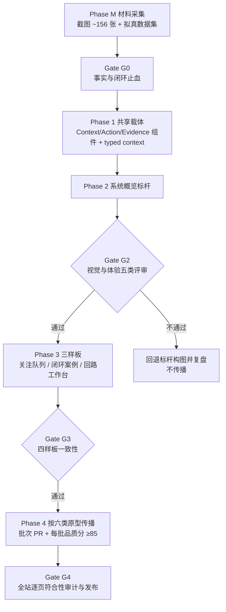

# CLPM IA → UX → UI 系统性重构最佳实践方案（总纲）

| 项目 | 内容 |
|---|---|
| 文档版本 | v1.1（新增 §11 页面设计通用规则：01 回路工作台标杆 v1.1~v1.10 评审沉淀，全页面强制） |
| 文档日期 | 2026-08-12 |
| 文档定位 | 重构总纲与最佳实践手册：把既有评审结论、实施方案与输入件整合为一条可执行主线；不替代任何上游决策文档 |
| 事实基线 | 实现契约 v2.11 ｜ PRD v6.2 ｜ UI/UX v6.3 ｜ 色彩约定 v1.0 ｜ 文案词表 v1.0 |
| 上游决策 | [IA v2.11 第一性原理复盘](../IA%20优化/10-IA-v2.11第一性原理复盘与优化建议-2026-08-11.md)（IA 决策）→ [IA 驱动 UIUX 重构方案 v1.1](../IA%20优化/11-IA驱动的UIUX重构与页面品质提升方案-2026-08-11.md)（实施方案）→ 产品设计重构依据集（输入件，存于 CLPM-DOCS 文档库 `11-产品设计重构/`，代码仓库不含此目录） |
| 安全边界 | 平台只读 DCS、不下写参数；只输出建议、证据、风险、回退与人工实施留痕——此边界贯穿全部阶段 |

---

## 0. 一页结论

CLPM 已完成"把功能放对位置"的第一轮 IA 重构（六模块骨架稳定）。本轮系统性重构的本质不是再搬家，而是三件事：

1. **先止血**：用户看到的每个主动作可执行、每个入口有权限、每处状态与文档一致——在坏事实上做新 UI 等于把 bug 装修进去；
2. **再立标杆**：把 IA 三条坐标（对象与范围 / 决策生命周期 / 工作状态）通过"系统概览"一个页面做成看得见的体验标杆（Precision Industrial Workbench），过 Gate G2 后才谈传播；
3. **按原型传播，不逐页自由发挥**：六类页面原型 → 四个样板验证 → 按原型映射传播 → 全站逐页符合性审计，避免 40+ 页面长出 40 套局部设计。

**做与不做一句话**：保留六模块、停止页面扩张、不做双架构、不大改 URL；把 IA 的中心从"功能在哪里"转向"一个高风险事项如何被可信地发现、负责地处理、独立地验证并留下证据"。

---

## 1. 重构背景与证据基线

### 1.1 为什么现在必须重构

| 证据 | 结论 | 来源 |
|---|---|---|
| UX/IA 审计（08-05） | P0-P3 共 21 项：认知负担、工作流断点、闭环管理缺失 | `过程文档/clpm-ux-ia-audit-report-2026-08-05.md` |
| IA 逐页评审（08-10） | 56 项问题（P2:21 + P3:35），复核修正 8 项 | `IA 优化/09-复核报告-2026-08-10.md` |
| Nielsen 启发式 | 20/40 → 整改后 32/40，遗留 BL-1~BL-9 | `06-UIUX/p2-exit-report-2026-08-09.md` |
| 闭环断点核查（08-11） | FP-P0-01~08：9 类 nextAction no-op、坏链接、权限死配置、Tracker 状态混用、默认首页三套定义 | `IA 优化/10` §6 |
| 核心矛盾 | 技术闭环已通（评估→诊断→整定→验证代码可达），**用户操作闭环未通**（断点、上下文丢失、信息密度、引导缺失） | `11-产品设计重构/00-总览/01-重构目标与范围.md` |

### 1.2 八条结构性矛盾（IA 复盘 §5，必须全部回应）

① 模块地图 ≠ 工作地图；② 回路工作台从编排器退化为超级页面；③ 上下文不是全站契约；④ 权限/可见性/任务适配混为一谈；⑤ 绩效预警与 DCS/SIS 报警未分界；⑥ Tracker 信息归属过窄；⑦ 人工实施交接缺职责分离；⑧ 文档与代码没有共同事实源。

### 1.3 已经做对、必须保留的资产

六模块骨架、实体轴/职能轴并存、五来源关注队列、工作台后端生命周期、可信度门禁、Tracker 验证状态机、工作台规模化基础（分页/虚拟滚动/懒加载）、18 项 UI/UX 强制门禁、157+ 项已闭环的 Backlog 整改。**重构是站在这些资产上，不是推倒。**

---

## 2. 五条总原则（从十二条设计公理提炼）

| # | 原则 | 执行含义 |
|---|---|---|
| P1 | **Truth First：事实先于界面** | 任何视觉工作前，先修事实错误（CTA/深链/权限/状态机/文档漂移）；坏事实不进入新 UI |
| P2 | **IA 坐标驱动界面，而非装饰驱动** | 每个页面必须能回答：对象与范围是什么、处于决策生命周期哪一段、工作状态是什么、归谁、下一步是什么 |
| P3 | **验证后的改善才是终点** | 计算完成、建议生成、参数已实施都不是闭环；所有干预路径汇聚到验证，效果无改善即重开 |
| P4 | **一个标杆，再谈传播** | 先做一个页面做到 ≥90 分并过五类门禁，验证"精密工业工程工作站"气质成立，再决定传播等级 S1/S2/S3；禁止 Gate G2 前默认全量重构 |
| P5 | **单一事实源是安全基础设施** | 路由、RBAC、状态机、默认首页、权限页、E2E、文档从同一机器可读来源派生或校验；漂移数自动检查为 0 |

---

## 3. 总体路线：一条主线，七道门

| 阶段 | 目标 | 关键交付物 | 出口门禁 |
|---|---|---|---|
| **M 材料采集**（进行中→待启动） | 建立重构前后对比的证据链与演示数据 | ~156 张全量截图 + 标注、4 类拟真数据集（高振荡/手动/卡涩/对比）+ KPI 校验 | 清单矩阵全覆盖；数据规格通过算法校验 |
| **0 止血** | 不把坏事实包进新 UI | FP-P0-01~08 全部修复；路由/权限/状态/CTA/裁切修复；现状基线测试 | P0 action/深链/状态契约测试全绿；悬空入口 = 0 |
| **1 共享载体** | 把 IA 坐标做成可复用组件 | typed OperationalContext（scope/evidence/work/time/navigation 五组信封）、Decision Dock、Evidence Canvas、State 组件族、固定 fixture | Story/demo 覆盖正常与异常状态；无角色字符串硬编码 |
| **2 标杆** | 系统概览成为视觉与体验标杆 | today-summary、角色镜头、装置绩效双镜头、决策坞 | **Gate G2 八项全过**（见 §4.3）+ 产品负责人选定传播等级 |
| **3 样板** | 验证队列、工作站、治理档案三种原型 | 关注队列（大规模加载契约）、闭环案例（trackerId-first API + 类型化干预）、回路工作台（编排器回归） | Gate G3：交互语法、视觉层级、状态与性能一致 |
| **4 传播** | 按六类页面原型映射到核心页面 | 原型映射表、批次 PR、迁移说明 | 每批页面品质分 ≥85、无 blocker |
| **5 审计发布** | 全站逐页核对 canonical route | 路由清单、全量截图、角色矩阵、性能报告 | Gate G4 通过；临时 flag/mock/旧组件清零 |

**顺序红线**：① Gate G2 不过不传播；② 闭环案例样板必须先完成 `interventionType` + 按类型校验的数据前置（Phase 3B），不得用假数据做"高保真完成态"；③ 回路工作台必须先修内容裁切和空动作，再谈视觉。

---

## 4. 各阶段最佳实践要点

### 4.1 Phase 0 止血：先修"确定断点"再谈设计

按 IA 复盘 §8.1 的六个工作包执行，全部有现成验收标准：

- **P0-A 闭环 CTA**：9 类 nextAction 全部落到明确动作，禁用态必须给出原因（不许 no-op）；
- **P0-B 路由与上下文**：修三类坏链接、loopId 不消费、plantNodeId 误传；静态路由测试 0 悬空；
- **P0-C 权限一致性**："可见即有权"率 100%；父权限取可见子路由并集；
- **P0-D Tracker 状态**：UI 只用 canonical 状态机（PENDING→IN_PROGRESS→VERIFYING→CLOSED/REOPENED）；
- **P0-E 事实源**：默认首页、权限页、角色称谓、E2E 说明与契约对齐；
- **P0-F 领域文案**：全站区分"绩效预警 / DCS·SIS 报警 / 关注项 / 闭环案例"，规则页与帮助持续声明"非 DCS 报警、不替代操作规程"。

### 4.2 Phase 1 共享载体：组件先于页面

把三条 IA 坐标物化为四件可复用资产，后续所有页面只允许"组装"不允许"自造"：

1. **OperationalContext（typed）**：scope / evidence / work / time / navigation 五组信封；业务判断一律按 ID 从服务端重载，不信 URL 里的展示字段；废止无消费者的 useLoopContext；
2. **Decision Dock（决策坞）**：每页唯一下一步 + 完整证据入口；
3. **Evidence Canvas（证据画布）**：结论必带时间、来源、可信度、阈值/基线；
4. **State 组件族**：loading / empty / partial / stale / error / 权限不足六态一等公民，固定 fixture 可复现。

### 4.3 Phase 2 标杆与 Gate G2：五类评审缺一不可

系统概览标杆页执行"装置绩效双镜头"（治理镜头 + 工程镜头）。**Gate G2 八项条件**（方案 §11.3）：18 项强制门禁 + Q-13~Q-16 语义门全过；品质分 ≥85 且无 blocker；四角色任务测试无 403/无不可执行 CTA；3 秒识别测试 4/5；1366/1440/1920/768 亮色通过且暗色代表状态配对；首屏与 BFF p95 达标；产品负责人明确选择 S1/S2/S3；临时数据与 mock 清零。

**传播等级决策纪律**：S0 仅保留标杆（方向存疑）；S1 只传播基础载体（结构有效、成本受限）；**S2 传播到 12~18 个核心页（推荐默认）**；S3 全量（需版本预算与回归资源）。

### 4.4 Phase 3 三样板：各自的前置条件

| 样板 | 验证的页面原型 | 不可跳过的前置 |
|---|---|---|
| 关注队列 | 大规模行动分诊列表 | TopN/已加载/全部/截断语义透明（Q-14）；1000 回路/10000 项加载契约 |
| 闭环案例 | 治理档案 | `trackerId-first` API + `interventionType` 类型化干预契约；PID 与非 PID 分开状态转换测试 |
| 回路工作台 | 证据编排器 | 修内容裁切与空动作；回归"选择回路、可信摘要、生命周期、唯一下一步"四职责，不把职能页塞进 Modal |

### 4.5 Phase 4~5 传播与审计

- **按原型映射，不按页面灵感**：每个核心页面先归类到六类原型之一，继承该原型的 Page Contract、动作矩阵和验收条目；
- **批次 PR**：每批 ≤5 页，每批品质分 ≥85 且无 blocker 才允许下一批；
- **Page Contract 必填**：页面名称即功能承诺——主任务、内容边界、主动作、产生什么持久结果，视觉设计前填完；伪命名是一票否决（Q-13）；
- **线框按需**：默认用 Page Contract + 结构表 + Given/When/Then 验收表达，只有复杂布局触发条件成立才补低保真线框；
- **终审**：全站 canonical route 清单 + 全量截图 + 角色权限矩阵 + 性能报告四件套，临时 flag、旧组件、mock 清零后才算发布。

---

## 5. 治理机制：让重构成果不腐烂

| 机制 | 做法 | 已有载体 |
|---|---|---|
| **单一事实源** | 路由/RBAC/状态机/默认首页/权限页/E2E 从同一机器可读清单派生或校验；漂移自动检查 = 0 | 实现契约 v2.11 |
| **版本基线锁定** | 每个工作包开工时锁定引用文档版本快照；源文档升级时同步溯源矩阵 | `11-产品设计重构/00-总览/03-术语版本与基线锁定.md` |
| **溯源纪律** | 新文档自包含核心内容但逐节标注源材料路径+版本+锚点；受控重复，不复制全文 | `00-总览/02-源材料溯源矩阵.md` |
| **归档纪律** | 被覆盖的文档及时移入 `docs/归档/`（保留相对路径+覆盖理由），防止旧口径被误当现行输入 | `docs/归档/README.md`（2026-08-12 建立） |
| **证据链** | 重构前后截图、品质评分、门禁结果全部留痕，可对比、可回溯 | `99-实施记录/01-采集执行日志.md` |
| **文档即门禁** | Page Contract、Q-01~Q-16、18 项强制项作为 CI/评审的可执行检查项，不是口号 | UI/UX v6.3 §14 + 方案 §12 |

---

## 6. 度量体系：怎么算重构成功

### 6.1 IA 层指标（IA 复盘 §10）

首个正确动作时间（5 角色基线后持续下降）｜上下文完整率（关键路径自动化 100%）｜可见即有权率（100%）｜悬空入口数（0）｜受理转化率｜无主事项率（0）｜验证超期率（持续下降）｜重开率（质量信号，不机械归零）｜INCONCLUSIVE 恢复时长｜事项重复率｜文档漂移数（0）。

### 6.2 页面品质评分（100 分，方案 §12.2）

任务与 IA 25 ｜ 证据与可信 20 ｜ 动作与闭环 20 ｜ 构图与层级 15 ｜ 工业品质一致性 10 ｜ 响应式与可访问 10。**标杆 ≥90 且无 blocker；可传播 ≥85 且无 blocker。**

### 6.3 量化门禁 Q-01~Q-16（方案 §12.3）

首屏三要素可见、单视觉锚点、单高强调主按钮、数值带基线/可信度、空白 ≤30%、事实不重复三次、单风险标记/行、3 秒识别 4/5、≤1 点击到工作台、状态不塌陷、1366 无横滚/裁切、light/dark 语义一致、名称-内容一致、TopN 语义透明、术语快照一致、主任务有持久结果。

### 6.4 运行验证八场景

ADMIN 新站点投用 / IC 班次处置 / PE 补充工艺证据 / EXPERT 接收升级案例 / SPONSOR 看治理成效 / 人工实施→验证或重开 / 数据不足→修复→续跑 / 异步任务失败→今日工作→重试或升级。

---

## 7. 执行协议（人或智能体通用）

1. **领取任务前必读顺序**：IA 复盘（为什么）→ 重构方案 v1.1（做什么、怎么验收）→ 实现契约相关章节（事实口径）→ Page Contract 模板；
2. **单任务提示词模板**：任务编号 / 目标页面 / Page Contract / 依赖门禁 / 验收条目（Given-When-Then）/ 禁止事项；
3. **实施约束**：不引入角色字符串硬编码；不用 mock 充完成态；legacy route 只做兼容跳转；每次提交绑定任务编号；
4. **证据回填**：完成后按固定格式回填——变更文件、测试结果、门禁逐项勾选、截图证据、遗留问题进 Backlog。

---

## 8. 风险登记册与降级路径

| 风险 | 缓解 / 降级 |
|---|---|
| 标杆页方向不被认可 | Gate G2 不过则只回退构图并复盘（S0），不传播，损失限制在一个页面 |
| 闭环案例做成"假完成态" | 强制 Phase 3B 数据前置；无 trackerId-first API 不动 UI |
| 工作台再次膨胀为超级页面 | 四职责红线 + Q-02 单视觉锚点 + 品质分构图维度一票否决 |
| 40+ 页面长出 40 套局部设计 | 六类原型映射 + 批次 PR + 每批 ≥85 分门禁 |
| 后端/前端无法启动采集截图 | 降级用 prototype React 原型 + mock（标"原型基线"）；或复用 e2e 既有 37 张基线截图 |
| 种子数据时间窗空洞/超密 | 采集窗口限定 7/30-8/3 稳定期 |
| 文档版本漂移 | 基线锁定 + 溯源矩阵 + 漂移自动检查 = 0 |
| 旧口径文档被误引用 | 归档纪律（已执行：27 份被覆盖文档移入 `docs/归档/`） |

---

## 9. 决策清单

**已决（上游文档锁定，不再重议）**：保留六模块 ｜ 不恢复"回路"一级模块 ｜ 不建双"驾驶舱/工作站"模式 ｜ 角色化首页而非第二套 IA ｜ Attention=派生投影 / Tracker 演进为持久闭环案例 ｜ 暂不新增独立 case 表 ｜ 工作台只做编排 ｜ 不大规模重命名 URL ｜ 永不做 DCS 下写。

**待决（需要在对应 Gate 拍板）**：
- Gate G2：传播等级 S1 / S2 / S3（默认推荐 S2）；
- Phase 3B 后：扩展后的 Tracker 是否仍不足以表达多来源多证据，决定是否引入 governance_case（P2-A）；
- 行为数据稳定后：是否把"异常跟踪"从诊断子菜单重命名迁移为"闭环案例"；
- 有真实 OPERATOR 任务研究后：是否评估操作员低密度视图（P2-E）。

---

## 10. 文档地图（本总纲的溯源）

| 层 | 文档 | 作用 |
|---|---|---|
| 决策层 | `IA 优化/10-IA-v2.11第一性原理复盘与优化建议-2026-08-11.md` | IA 目标模型、八矛盾、P0-P2 路线图、成功指标 |
| 实施层 | `IA 优化/11-IA驱动的UIUX重构与页面品质提升方案-2026-08-11.md` v1.1 | 四样板 Page Contract、Gate G0-G4、Q-01~Q-16、任务清单、智能体协议 |
| 输入层 | `11-产品设计重构/`（20 份） | 截图规范、角色画像、ISA-101 评估、拟真数据规范、交互路径 |
| 事实层 | 实现契约 v2.11 ｜ PRD v6.2 ｜ UI/UX v6.3 ｜ 色彩约定 v1.0 ｜ 文案词表 v1.0 | 现行口径，冲突时以此为准 |
| 证据层 | UX/IA 审计 08-05 ｜ IA 评审包 08-10 ｜ p2 出口报告 08-09 ｜ 视觉走查 MW-P5-05 | 问题清单与整改基线 |

> 本总纲与上游文档冲突时，以上游决策文档为准；上游修订后，本总纲按溯源矩阵同步。

---

## 11. 页面设计通用规则（01 标杆评审沉淀 · 全页面强制）

> 以下来自 01 回路工作台标杆 v1.1~v1.10 共十轮人机评审的拍板结论，已从单页设计升格为**全页面通用规则**。所有页面标杆（01/02/03…）与实施智能体必须逐条遵循；每条标注沉淀来源（01 标杆文档版本/章节），便于溯源。页面级设计文档只写本页特有约定，不重复本节。

### R-A 数据诚实（Truth First 的页面级落地）

| # | 规则 | 来源 |
|---|---|---|
| A1 | **指标溯源清单制度**：每页必须维护"页面元素 → API 端点 → 后端计算 → 数据表/字段"唯一溯源表；凡表外取数（手算、硬编码、mock）均视为缺陷 | 01 §2.5 |
| A2 | **页面文字三级来源**：①结构化字段（算法/数据库输出，必有端点）；②规则模板短句（须标注"规则模板"）；③LLM 生成叙述（受门控，**未接入时不渲染该区域且不留空白**）。禁止出现无来源的"看起来像分析结论"的静态文字 | 01 §2.3 规则 7 |
| A3 | **阈值/告警线一律取配置端点**：定级阈值取 `GET /configs/grading-thresholds`（配置·指标配置·定级阈值 tab），指标阈值取 `get_threshold(control_type)`；**禁止硬编码任何阈值数字**；配置未加载时降级 GB/T 44693.2 §6.3 默认并显式标注 | 01 v1.3 |
| A4 | **评分等级中文五档**：优秀（绿）/良好（蓝）/合格（琥珀）/警告（红）/不合格（红），按综合评分映射动态阈值；**评分为空显示中性灰，严禁映射红色** | 01 v1.2/v1.3 |

### R-B 指标语义与数值规范

| # | 规则 | 来源 |
|---|---|---|
| B1 | **正向/负向指标图形语义相反**：正向指标（平稳率/准确率等）横道长=好，带阈值标线；负向指标（饱和率/粘滞系数/稳定时间/振荡率）条越长越差，图形语言不得混用 | 01 v1.6/v1.7 |
| B2 | **实时点值规范**：PV/SP 固定两位小数、等宽字体；OP 百分比；MODE 徽章；异常值（PV 偏离 SP 超阈值或质量码非 GOOD）显色 | 01 v1.7 |
| B3 | **快照类指标**固定取最新快照，并标注计算窗口（如"近 24h 窗口"），不得伪装成实时值 | 01 §2.6 |
| B4 | **混合图分工**：趋势线用折线（走向），逐时点对比用棒图；棒图粒度自适应——8h/24h 按小时、72h 按 2h 桶、168h 聚合为日，防止密集成糊；告警线图层必须在棒图之上 | 01 v1.9 |

### R-C 时间窗三层语义（防止"一切联动"的误联动）

| 层 | 元素类型 | 时间窗行为 | 来源 |
|---|---|---|---|
| **A 趋势类** | 过程趋势、KPI 历史图 | 随时间窗联动取数 | 01 §2.6 |
| **B 快照类** | 当前 KPI、雷达图、横道图、评分/等级 | 不联动，固定最新快照 + 标注计算窗口 | 01 §2.6 |
| **C 状态事件类** | 生命周期、下一步、时间线、诊断/整定卡 | 不联动，标注事件时间 | 01 §2.6 |

时间窗选择器档位固定为 `[8h | 24h | 72h | 168h | 自定义]`，自定义起止精确到分钟；**时间窗放在其作用的画布区域内**，置页头会误导为全页联动（01 v1.5/v1.6）。

### R-D 布局与信息密度

| # | 规则 | 来源 |
|---|---|---|
| D1 | **单视觉锚点**：主画布占主区域 ≥45% 高度；一屏不得出现两个以上同权重视觉块 | 01 §1/Q-02 |
| D2 | **卡片全宽撑满、不留大段空白**：卡片区通栏布局，内容分行均分撑满卡片高度；信息密度优先于留白美学 | 01 v1.5/v1.10 |
| D3 | **证据卡只放"结论 + 时间 + 可信度 + 完整证据深链"**：完整证据留在职能页，工作台是编排器不是容器 | 01 §2.3 规则 3 |
| D4 | **缩略图不得与主画布内容重复**（重复即删，把空间让给增量信息） | 01 v1.8 |
| D5 | **趋势图必须有完整坐标轴**（X 时间轴随档位自适应刻度）；事件标记图例带文字自解释（▼诊断 ◆整定 ▐验证窗 ▓缺口） | 01 v1.4 |

### R-E 导航与检索（千级回路规模）

| # | 规则 | 来源 |
|---|---|---|
| E1 | **树只到装置/单元级**：回路不作为树叶出现；树节点带异常数/最低分聚合（范围轴） | 01 §2.3 规则 5 |
| E2 | **搜索双支持**：搜索框同时支持装置/单元名（圈定树范围）与回路位号/描述（直达回路） | 01 v1.2 |
| E3 | **规模化三场景**："圈范围 → 找例外 → 搜具体"；不以"全量浏览"为设计目标；服务端分页（≤100/页）/虚拟滚动；500+/1000 回路压测列入验收前置 | 01 §2.3 规则 5 |
| E4 | **左脊柱可沉浸折叠**（折叠按钮放区域底部），最大化主显示区宽度 | 01 v1.3 |
| E5 | **面→点上下文保持**：列表↔工作台互跳时保留筛选条件与时间窗；进入/离开用受控 route ID，业务判断按 ID 从服务端重载 | 01 §2.3 规则 6 |

### R-F 动作、状态与安全

| # | 规则 | 来源 |
|---|---|---|
| F1 | **唯一主动作**：每页一个 Decision Dock 主按钮；9 类 nextAction 全部可执行；**禁用态必须显示后端给出的原因**；no-op CTA 一票否决 | 01 §1/§2.3 规则 4 |
| F2 | **状态面六态全设计**：loading / empty / partial（显式标注缺哪块）/ stale / error / 无权限，不得全白或布局塌陷 | 01 §1 |
| F3 | **角色可见即有权**：IC 全功能；PE 无整定动作；EXPERT 只读+升级；SPONSOR 不出现工程动作按钮 | 01 §1 |
| F4 | **DCS 安全边界**：平台只读 DCS、不下写参数；固定安全文案（"回退参数已记录 · 平台不自动下写 DCS"）为静态文案，不属于 A2 三级来源的叙述区 | 01 v1.8 |
| F5 | **关注/收藏只做一个概念**："关注"（watchlist），数据表 `user_loop_mark` + `/users/me/marks` 端点；操作入口在页头星标与列表行内星标，**不新增一级页面**；本期不实施，后续单独立项 | 01 §2.7 |

### 执行要求

- 实施智能体领取任何页面任务前，本节与总纲 §7 执行协议同为必读；
- 页面标杆评审时，本节规则为默认检查项，页面特有规则在各自 Page Contract 中增补；
- 本节只增不删：后续页面评审拍板的新通用规则追加到对应分组并标注来源版本。
