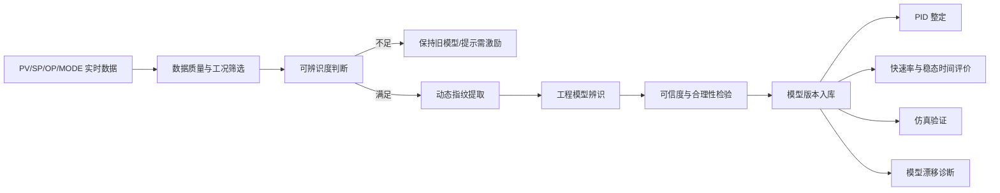
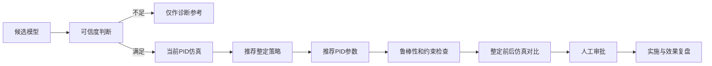

# 控制回路在线过程辨识技术方案建议

**文档版本：** V1.0  
**适用对象：** CLPM/PDS 产品团队、算法工程师、控制工程师、后端架构师、实施工程师  
**文档用途：** 作为在线过程对象辨识模块的产品规划、算法设计、技术实现与工程验证输入

---

## 1. 文档背景

在控制回路性能评估、故障诊断和 PID 参数整定系统中，过程对象模型是连接“监测”与“优化”的核心中间层。

在线过程辨识的目标，不是为了追求复杂模型本身，而是在尽量不扰动生产的前提下，利用控制回路运行数据持续获得以下动态信息：

- 过程增益 \(K\)
- 过程时间常数 \(\tau\)
- 纯滞后 \(\theta\)
- 积分特性、反向响应特性和主要动态阶次
- 对象动态是否随负荷、工况、批次阶段发生变化
- 当前数据是否足以支持可靠辨识
- 当前模型是否仍可用于 PID 整定与仿真

因此，在线过程辨识模块应服务于以下业务闭环：



---

## 2. 核心原则

### 2.1 先判断能不能辨识，再决定如何辨识

在线辨识不是“每个窗口都必须输出一个模型”。

从信息论和系统辨识角度看，如果输入 OP/MV 几乎不变化，或输出 PV 的变化主要由不可测扰动造成，那么真实对象参数并不具备可辨识性。

系统必须允许输出：

> 当前数据激励不足或输入输出关系不显著，模型不更新。

这比强行得到一个拟合度看似不错、实际上不可用于控制的模型更专业。

### 2.2 先提取动态指纹，再压缩为工程模型

工程人员最终关心的不是高阶离散模型系数，而是：

- 对象是快还是慢
- 滞后有多大
- 增益方向如何
- 是否为积分过程
- 是否存在明显非线性
- 当前模型是否可信
- 是否适合重新整定 PID

因此推荐采用两层结构：

```text
第一层：动态指纹识别
第二层：FOPDT / SOPDT / 积分过程等工程模型辨识
```

### 2.3 被动辨识为主，主动激励为辅

对化工现场，默认采用正常生产数据进行被动辨识；仅在关键回路专项优化、调试期或获得审批后，使用小阶跃、PRBS、继电反馈等主动激励。

### 2.4 模型必须版本化，不得直接覆盖

不同负荷、原料、环境和设备状态下，过程对象会变化。模型必须按工况、批次阶段和时间版本管理。

---

## 3. 推荐模型库

### 3.1 一阶惯性加纯滞后模型 FOPDT

\[
G_p(s)=\frac{K e^{-\theta s}}{\tau s+1}
\]

适用于大多数流量、压力、温度和一般过程回路。

### 3.2 二阶惯性加纯滞后模型 SOPDT

\[
G_p(s)=\frac{K e^{-\theta s}}{(\tau_1 s+1)(\tau_2 s+1)}
\]

适用于换热、温度、大惯性和复合动态过程。

### 3.3 积分过程模型

\[
G_p(s)=\frac{K e^{-\theta s}}{s}
\]

适用于液位、库存、物料累积等过程。

### 3.4 积分加惯性模型

\[
G_p(s)=\frac{K e^{-\theta s}}{s(\tau s+1)}
\]

适用于缓冲罐、慢液位以及存在附加动态环节的库存过程。

### 3.5 反向响应模型

用于输出先向反方向变化、随后才向最终方向变化的过程。

### 3.6 非参数脉冲响应模型

\[
y(k)=\sum_{i=0}^{N} g_i u(k-i)+e(k)
\]

适合作为在线动态指纹、模型压缩和算法中间结果，不直接面向普通用户展示。

---

## 4. 推荐的三层辨识体系

## 4.1 第一层：在线动态指纹层

该层长期运行，计算量低，不直接给出最终 PID 参数。

### 4.1.1 输入激励强度

可采用：

\[
E_u=\operatorname{std}(\Delta OP)
\]

或：

\[
E_u=\max(OP)-\min(OP)
\]

必要时按量程归一化：

\[
E_{u,norm}=\frac{\max(OP)-\min(OP)}{OP_{high}-OP_{low}}
\]

当激励不足时，不进入模型更新。

### 4.1.2 OP-PV 互相关

\[
R_{uy}(\tau)=E[(u(t)-\bar{u})(y(t+\tau)-\bar{y})]
\]

归一化后：

\[
\rho_{uy}(\tau)=\frac{R_{uy}(\tau)}{\sigma_u\sigma_y}
\]

可用于：

- 判断输入对输出是否存在可观测影响
- 粗略估计纯滞后
- 判断增益方向
- 发现外部扰动主导的时间段

滞后粗估：

\[
\hat{\theta}\approx \arg\max_\tau |\rho_{uy}(\tau)|
\]

### 4.1.3 频谱比值与相干函数

对于线性时不变系统：

\[
Y(j\omega)=G(j\omega)U(j\omega)
\]

稳健的频率响应估计为：

\[
\hat G(j\omega)=\frac{S_{yu}(\omega)}{S_{uu}(\omega)}
\]

相干函数为：

\[
\gamma^2(\omega)=
\frac{|S_{yu}(\omega)|^2}
{S_{uu}(\omega)S_{yy}(\omega)}
\]

相干度高的频段，说明 OP 对 PV 的解释能力强；相干度低的频段，不应用于模型拟合。

### 4.1.4 动态指纹输出

建议输出：

| 指标 | 工程含义 |
|---|---|
| 增益方向 | OP 增加时 PV 最终增大或减小 |
| 滞后粗估 | OP 变化后 PV 开始响应的延迟 |
| 主响应时间 | 对象快慢 |
| 低频增益 | 稳态放大能力 |
| 主动态频段 | 对象有效控制频带 |
| 噪声比 | 高频能量占比 |
| 积分特性评分 | 是否持续斜坡响应 |
| 非线性迹象 | 不同工况增益是否明显变化 |
| 可辨识度评分 | 当前窗口是否可用于建模 |

---

## 4.2 第二层：事件触发工程模型辨识层

当系统检测到有效的 OP 或 SP 变化、自然扰动响应或审批后的测试信号时，触发工程模型辨识。

### 4.2.1 阶跃片段识别

有效阶跃应满足：

- 输入变化量超过检测阈值
- 阶跃前存在相对稳定基线
- 阶跃后输入保持足够时间
- PV 响应幅度高于噪声
- 回路模式明确
- OP 未长期饱和
- 数据质量正常
- 外部强扰动较弱

### 4.2.2 面积法 / 矩方法

对 FOPDT 阶跃响应：

\[
y(t)=K\Delta u\left(1-e^{-(t-\theta)/\tau}\right)
\]

归一化响应：

\[
r(t)=\frac{y(t)-y_0}{y_\infty-y_0}
\]

则：

\[
A_0=\int_0^\infty [1-r(t)]dt\approx \theta+\tau
\]

若已通过互相关或响应起点估计 \(\theta\)，则：

\[
\tau\approx A_0-\theta
\]

过程增益为：

\[
K=\frac{y_\infty-y_0}{u_1-u_0}
\]

面积法利用整段响应，较传统 63.2% 单点法对噪声更稳健。

### 4.2.3 多候选模型并行拟合

同一片段建议同时拟合：

- FOPDT
- SOPDT
- 积分过程
- 积分加惯性
- 反向响应模型

模型选择不能只看拟合误差，还应考虑：

- 参数是否物理合理
- 模型阶次是否必要
- 换一段数据能否复现
- 残差是否近似白噪声
- 是否适合 PID 整定
- 是否具有足够鲁棒性

---

## 4.3 第三层：平滑脉冲响应在线跟踪层

推荐采用：

> Laguerre/Kautz 正交基函数 + 递推最小二乘

### 4.3.1 基本形式

\[
g(k)=\sum_{i=1}^{m}c_iL_i(k)
\]

其中 \(L_i(k)\) 为稳定正交基函数。

输出模型：

\[
y(k)=\phi^T(k)c+e(k)
\]

可采用带遗忘因子的递推最小二乘在线更新：

\[
\hat c(k)=\hat c(k-1)+K(k)
[y(k)-\phi^T(k)\hat c(k-1)]
\]

### 4.3.2 优点

- 参数数量少
- 比高阶 ARX 更平滑
- 正交基函数本身稳定
- 适合在线递推
- 不容易过拟合
- 可得到平滑脉冲响应
- 可进一步压缩成 FOPDT/SOPDT

### 4.3.3 从脉冲响应提取动态矩

过程增益：

\[
K=\sum_k g(k)T_s
\]

平均响应时间：

\[
\mu=
\frac{\sum_k kT_s g(k)}
{\sum_k g(k)}
\]

响应时间方差：

\[
\sigma_t^2=
\frac{\sum_k(kT_s-\mu)^2g(k)}
{\sum_k g(k)}
\]

这些动态矩可进一步用于估计主要时间常数和纯滞后。

---

## 5. 在线辨识的工程数据筛选

## 5.1 控制模式识别

| 模式 | 推荐策略 |
|---|---|
| MAN | 优先用于 OP→PV 开环辨识 |
| AUTO | 采用闭环辨识，需防反馈偏差 |
| CAS | 可分析外部 SP→PV 和副回路动态 |
| RCAS/APC | 需识别上层控制器影响 |
| 停用/检修 | 不参与辨识 |

## 5.2 数据质量检查

必须处理：

- 坏值
- 通讯中断
- 冻结
- 突跳
- 超量程
- 时间戳异常
- 采样周期不一致
- PV/SP/OP/MODE 不同步

## 5.3 约束状态排除

以下情况原则上不更新正常对象模型：

- OP 长期饱和
- 阀门卡限
- 联锁动作
- 设备启停
- 开停车
- 大幅工况切换
- 明显外部扰动
- 人工频繁干预

## 5.4 闭环偏差问题

自动状态下，OP 与扰动、噪声和 PV 反馈相关，普通最小二乘可能有偏。

推荐逐步引入：

1. 严格片段筛选
2. 输出误差模型 OE
3. 工具变量法 IV
4. 预测误差法 PEM/RPEM
5. 联合输入输出闭环辨识

---

## 6. 可辨识度评分

建议将可辨识度定义为多个因子的组合：

\[
I_{id}=
Q_{data}
\cdot E_{input}
\cdot R_{response}
\cdot C_{coherence}
\cdot M_{mode}
\cdot P_{constraint}
\]

其中：

- \(Q_{data}\)：数据质量
- \(E_{input}\)：输入激励
- \(R_{response}\)：输出响应可观测性
- \(C_{coherence}\)：输入输出相干度
- \(M_{mode}\)：控制模式有效性
- \(P_{constraint}\)：非饱和、非约束状态因子

建议分级：

| 评分 | 结论 |
|---:|---|
| 85–100 | 高可辨识，可自动生成候选模型 |
| 70–85 | 中高可辨识，可生成模型并建议人工确认 |
| 50–70 | 中可辨识，仅供趋势和漂移参考 |
| <50 | 不可辨识，模型不更新 |

---

## 7. 模型可信度评价

模型可信度建议包含：

| 维度 | 建议权重 |
|---|---:|
| 数据质量 | 15% |
| 输入激励充分性 | 15% |
| 输入输出相干度 | 15% |
| 拟合优度 | 20% |
| 残差检验 | 10% |
| 参数物理合理性 | 10% |
| 交叉验证一致性 | 10% |
| 工况稳定性 | 5% |

可信度不是拟合度的同义词。一个高阶模型即使拟合很好，只要参数不合理或跨片段失效，也不能用于 PID 整定。

---

## 8. 产品功能设计建议

## 8.1 在线辨识工作台

应包括：

- 回路选择
- 时间范围选择
- 自动推荐候选片段
- OP/SP 变化事件列表
- PV/SP/OP/MODE 联动趋势
- 可辨识度评分
- 候选模型列表
- 拟合曲线
- 残差图
- 模型参数及置信区间
- 工程合理性检查
- 人工确认与模型入库

## 8.2 自动在线辨识服务

后台能力：

- 滑动窗口扫描
- 事件触发
- 动态指纹更新
- 候选片段生成
- 多模型拟合
- 可信度打分
- 模型漂移检测
- 低可信度冻结
- 模型版本化

## 8.3 模型档案

建议字段：

```text
model_id
loop_id
model_type
model_source
control_mode
operating_condition
batch_stage
sample_time
k_process
tau_1
tau_2
dead_time
fit_score
rmse
mae
residual_score
excitation_score
coherence_score
data_quality_score
confidence_score
valid_from
valid_to
approved_status
version
```

---

## 9. 与 PID 整定模块的衔接

模型辨识结果应进入以下流程：



整定策略至少支持：

- Lambda/IMC
- 稳健优先
- 快速优先
- 平稳优先
- 阀门保护优先
- 液位缓冲优先
- 温度慢过程优先

---

## 10. 版本路线建议

### V1.0：半在线工程辨识

- 人工选择时间段
- 自动发现 OP/SP 阶跃
- FOPDT/SOPDT/积分模型
- 面积法初值
- 非线性最小二乘微调
- 拟合曲线与可信度
- 模型版本管理

### V1.5：自动片段与动态指纹

- 滑动窗口
- 互相关
- 相干函数
- 频率响应粗估
- 可辨识度评分
- 自动候选片段
- 批量辨识

### V2.0：连续在线跟踪

- Laguerre/Kautz + RLS
- 模型漂移检测
- 多工况模型
- 闭环 OE/IV/PEM
- 低可信度冻结
- 自动触发重新整定建议

### V3.0：高级多变量与智能辨识

- 子空间辨识
- MIMO 动态模型
- 批次阶段模型
- 非线性增益调度
- EKF/UKF 参数跟踪
- AI 辅助模型解释

---

## 11. 关键风险与控制措施

| 风险 | 影响 | 控制措施 |
|---|---|---|
| 输入激励不足 | 模型虚假稳定 | 可辨识度门控，不更新 |
| 闭环反馈偏差 | 参数有偏 | OE/IV/PEM，严格筛选 |
| 工况变化 | 单模型失效 | 多工况模型、版本管理 |
| 输出饱和 | 模型反映约束而非对象 | 饱和片段排除 |
| 外部扰动 | 输入输出关系失真 | 相干度和多变量检查 |
| 阀门非线性 | 线性模型失效 | 分区模型、阀门特性诊断 |
| 采样不合理 | 动态失真 | 采样周期与时间常数匹配 |
| 模型过拟合 | 仿真好、现场差 | 低阶优先、交叉验证 |
| 自动调参风险 | 影响生产安全 | 默认只读、人工审批 |

---

## 12. 最终推荐方案

综合数学优雅性、在线计算成本、工程可解释性和现场健壮性，推荐采用：

> **动态指纹识别 + 事件触发面积法/矩方法 + 频谱相干验证 + Laguerre/Kautz 在线平滑辨识**

核心流程为：

```text
PV/SP/OP/MODE 数据
→ 数据质量与模式判断
→ 输入激励与相干度评估
→ 可辨识度门控
→ 互相关估计滞后与增益方向
→ 阶跃面积法生成 FOPDT 初值
→ 多候选模型拟合与交叉验证
→ Laguerre/RLS 持续跟踪动态
→ 模型可信度评分
→ 模型版本入库
→ PID 整定、仿真与诊断
```

这条路线避免了“一开始就依赖复杂黑箱模型”，同时保留了向闭环 PEM、工具变量、子空间和多变量辨识扩展的空间，适合化工控制回路性能监测与 PID 整定产品的长期演进。
